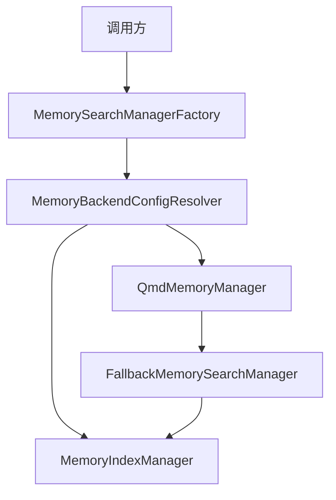
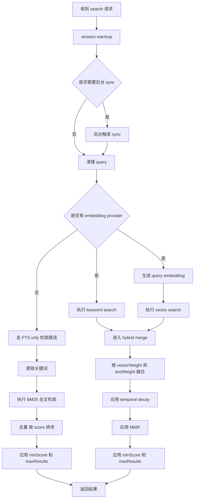
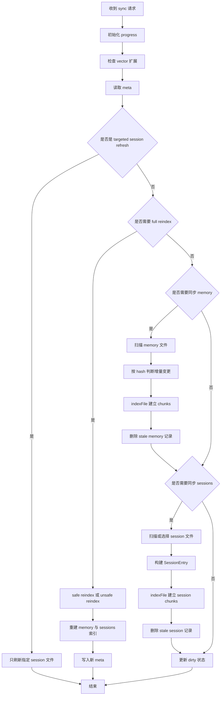
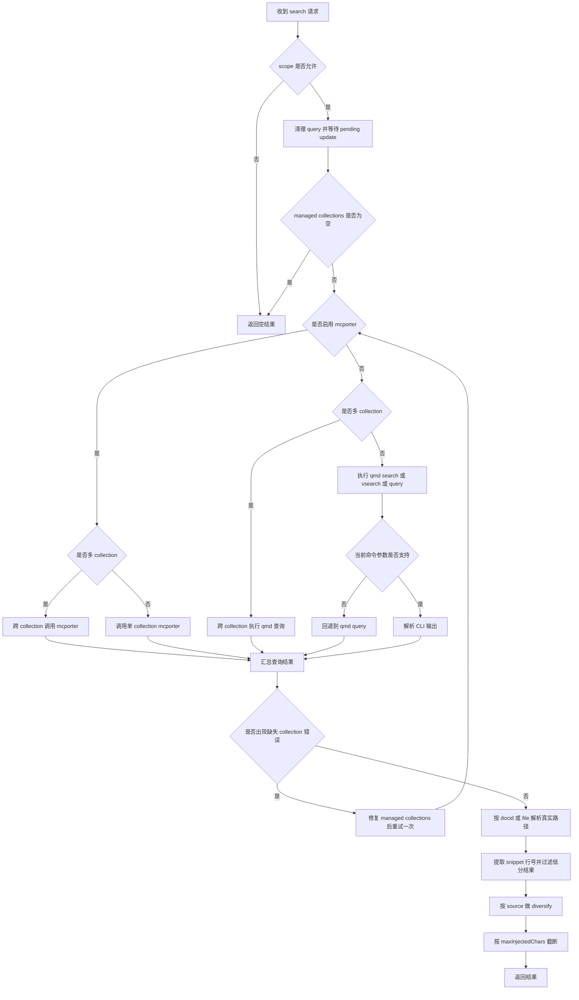
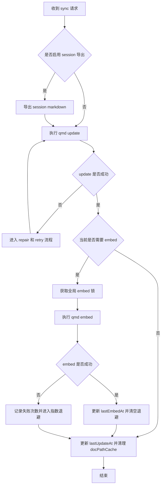

Memory 模块架构文档

## 1. 文档目标

这份文档面向 `src/memory` 的源码实现，目标不是复述代码细节，而是把当前 TypeScript 版 Memory 的真实架构整理成一份适合 Java 实现的设计说明。

本文重点回答 5 个问题：

1. Memory 模块对外到底暴露了哪些能力。
2. `builtin` 和 `qmd` 两种后端分别怎么工作。
3. 搜索、同步、读文件、状态查询在两种后端里分别怎么落地。
4. Java 版应该如何命名接口、类和分层。
5. 当前 `memory-java` 草稿还缺哪些关键能力。

本文只做架构设计，不包含具体代码实现。

## 2. 模块定位

`memory` 不是单纯的向量库封装，而是一个统一的记忆检索协调层。它把两类数据源统一成可检索记忆：

- `memory`：工作区中的 `MEMORY.md`、`memory.md`、`memory/**/*.md`，以及配置中的 `extraPaths`
- `sessions`：Agent 历史会话 transcript

它对上层统一暴露以下能力：

- 搜索记忆
- 同步索引
- 读取记忆文件
- 查询后端状态
- 探测 embedding 和 vector 能力
- 关闭资源

从职责上看，`memory` 同时承担：

- 数据源扫描器
- 索引构建器
- 检索协调器
- 后端路由器
- 失败降级器

## 3. 统一对外接口

### 3.1 核心接口

TypeScript 中真正的统一对外接口是 `MemorySearchManager`。Java 版建议保留同名接口。

| 能力 | TS 接口 | Java 建议接口 | 说明 |
| - | - | - | - |
| 搜索 | `search(query, opts)` | `search(String query, SearchOptions opts)` | 统一检索入口 |
| 读文件 | `readFile(params)` | `readFile(ReadFileRequest request)` | 读取记忆文件全部内容或部分行段 |
| 状态 | `status()` | `status()` | 返回当前后端、索引和能力状态 |
| 同步 | `sync(params)` | `sync(SyncRequest request)` | 增量同步或强制重建 |
| embedding 探测 | `probeEmbeddingAvailability()` | `probeEmbeddingAvailability()` | 返回是否可用及失败原因 |
| vector 探测 | `probeVectorAvailability()` | `probeVectorAvailability()` | 返回向量检索是否可用 |
| 关闭 | `close()` | `close()` | 关闭 watcher、DB、CLI 资源 |

### 3.2 建议保留的 Java DTO 名称

建议 Java 版至少保留以下名称：

- `MemorySearchManager`
- `MemorySearchResult`
- `MemoryProviderStatus`
- `MemoryEmbeddingProbeResult`
- `MemorySyncProgressUpdate`
- `SearchOptions`
- `ReadFileRequest`
- `ReadFileResult`
- `SyncRequest`

### 3.3 `MemorySearchResult` 的语义

搜索结果的统一字段如下：

| 字段 | 含义 |
| - | - |
| `path` | 相对工作区的逻辑路径 |
| `startLine` | 命中片段起始行 |
| `endLine` | 命中片段结束行 |
| `score` | 归一化后的相关度分数 |
| `snippet` | 返回给上层注入或展示的文本片段 |
| `source` | `memory` 或 `sessions` |
| `citation` | 可选引用文本 |

### 3.4 `MemoryProviderStatus` 的语义

`status()` 不是简单的计数接口，而是一个运行时状态快照。Java 版建议把它拆成多层结构，而不是全部平铺字段。

推荐分层如下：

- 基本信息：`backend`、`provider`、`model`、`requestedProvider`
- 索引信息：`files`、`chunks`、`dirty`、`workspaceDir`、`dbPath`
- 作用域信息：`sources`、`extraPaths`、`sourceCounts`
- 子系统状态：`cache`、`fts`、`vector`、`batch`
- 降级信息：`fallback`
- 扩展信息：`custom`

## 4. 入口与后端选择

真正的入口不是 `MemoryIndexManager` 或 `QmdMemoryManager`，而是 `getMemorySearchManager`。它会根据配置决定使用哪个后端。

决策要点：

- 默认后端是 `builtin`
- 当配置指定 `qmd` 时，优先创建 `QmdMemoryManager`
- 如果 `qmd` 初始化失败或运行中失败，则自动降级到 `builtin`
- 对同一个 agent 和同一份有效配置，manager 会被缓存复用

### 4.1 总体运行时关系



### 4.2 Java 版建议保留的顶层对象

| 角色 | 建议名称 | 说明 |
| - | - | - |
| 统一接口 | `MemorySearchManager` | 对上层隐藏后端差异 |
| 工厂 | `MemorySearchManagerFactory` | 对应 `getMemorySearchManager` |
| 内置后端 | `MemoryIndexManager` | builtin 实现入口 |
| QMD 后端 | `QmdMemoryManager` | qmd 实现入口 |
| 降级包装器 | `FallbackMemorySearchManager` | 负责 primary 和 fallback 切换 |

## 5. 配置解析与运行时设置

Memory 的运行时行为不是直接从原始配置读取，而是先经过两层解析：

- `resolveMemorySearchConfig`：解析 builtin 路径需要的完整运行时配置
- `resolveMemoryBackendConfig`：决定最终后端是 `builtin` 还是 `qmd`

Java 版建议拆成两个对象：

- `MemoryRuntimeConfigResolver`
- `MemoryBackendSelector`

推荐让它们输出两个不可变对象：

- `ResolvedMemorySearchConfig`
- `ResolvedMemoryBackendConfig`

这些解析后的配置至少应包含：

- `sources`
- `extraPaths`
- `provider`
- `model`
- `fallback`
- `store.path`
- `store.vector.enabled`
- `chunking.tokens`
- `chunking.overlap`
- `sync.onSearch`
- `sync.watch`
- `sync.intervalMinutes`
- `query.maxResults`
- `query.minScore`
- `query.hybrid.vectorWeight`
- `query.hybrid.textWeight`
- `query.hybrid.mmr`
- `query.hybrid.temporalDecay`
- `cache.enabled`
- `qmd.searchMode`
- `qmd.collections`
- `qmd.sessions`
- `qmd.update`
- `qmd.mcporter`

## 6. 数据源与索引对象

### 6.1 数据源分类

Memory 模块只关心两类 source：

- `memory`
- `sessions`

Java 版建议显式定义枚举：

- `MemorySource.MEMORY`
- `MemorySource.SESSIONS`

### 6.2 `memory` 源的扫描范围

builtin 后端会扫描：

- 工作区根下的 `MEMORY.md`
- 工作区根下的 `memory.md`
- 工作区下的 `memory/` 目录
- 配置里的 `extraPaths`

并且会跳过：

- 符号链接
- 不允许的文件类型
- 监控时的典型忽略目录，如 `.git`、`node_modules`

### 6.3 `sessions` 源的转换方式

会话 transcript 不是直接原样建立索引，而是经过一层适配：

- 读取 `.jsonl`
- 只提取 `user` 和 `assistant` 消息
- 抽取文本块内容
- 进行敏感信息脱敏
- 组装成普通文本
- 维护 `lineMap`，把生成文本行映射回原始 transcript 行号

Java 版建议保留专门组件：

- `SessionTranscriptAdapter`

### 6.4 builtin SQLite 索引对象

内置后端的 SQLite 逻辑上至少包含以下对象：

| 对象 | 作用 |
| - | - |
| `meta` | 保存索引元信息，用于判断是否需要 full reindex |
| `files` | 保存文件级元数据，如 path、hash、mtime、size、source |
| `chunks` | chunk 主表，保存文本、line range、embedding、model |
| `chunks_fts` | FTS5 全文索引 |
| `chunks_vec` | `sqlite-vec` 向量索引 |
| `embedding_cache` | embedding 缓存 |

### 6.5 QMD 的索引状态

QMD 后端不直接写 builtin 的 SQLite schema，而是依赖外部工具自己的索引状态。对 Java 版来说，应理解为另一套独立索引域：

- agent 级 XDG config 目录
- agent 级 XDG cache 目录
- `qmd/index.sqlite`
- managed collections
- 可选 session exporter 目录

## 7. Builtin 后端架构

### 7.1 Builtin 后端的真实职责

TypeScript 中 builtin 侧的职责散落在多个文件中。Java 版不建议做成一个巨型类，而是建议组合式拆分。

| 逻辑角色 | TS 对应位置 | Java 建议名称 | 职责 |
| - | - | - | - |
| 对外 facade | `manager.ts` | `MemoryIndexManager` | 实现统一接口，协调内部组件 |
| 同步协调 | `manager-sync-ops.ts` | `MemorySyncCoordinator` | sync、watch、reindex、session 更新 |
| embedding 建索引 | `manager-embedding-ops.ts` | `MemoryEmbeddingIndexer` | chunking、embedding、upsert、cache |
| 查询执行 | `manager-search.ts` | `MemoryQueryEngine` | keyword、vector、hybrid |
| schema 管理 | `memory-schema.ts` | `MemorySchemaManager` | 建表、索引、schema 演进 |
| SQLite 访问 | 多处 DB 调用 | `MemoryIndexRepository` | 隔离 SQL 语义 |
| 文件扫描 | `internal.ts` | `MemoryFileScanner` | 枚举 memory 文件、构建文件条目 |
| 会话适配 | `session-files.ts` | `SessionTranscriptAdapter` | `jsonl -> session entry` |
| 混合排序 | `hybrid.ts` | `HybridResultMerger` | 权重融合、MMR、时间衰减 |
| provider 构造 | `embeddings.ts` | `EmbeddingProviderFactory` | 创建 embedding provider |

### 7.2 Builtin 搜索流程



### 7.3 Builtin 同步流程



### 7.4 Builtin `indexFile` 的内部职责

`indexFile` 是 builtin 的核心建索引动作。Java 版建议将其单独归入 `MemoryEmbeddingIndexer`。

其内部步骤是：

1. 读取文件内容或 session 转换后的内容。
2. 执行 Markdown chunking。
3. 对 session chunk 进行行号重映射。
4. 检查 embedding cache。
5. 以 batch 或普通模式调用 embedding provider。
6. 将结果写入 `chunks`。
7. 将文本写入 `chunks_fts`。
8. 将向量写入 `chunks_vec`。
9. 更新 `files` 记录。

### 7.5 Builtin 的关键机制

#### 7.5.1 索引元信息

`meta` 不是可有可无的附属表，而是 full reindex 判断核心。Java 版建议保留 `MemoryIndexMeta`：

- `model`
- `provider`
- `providerKey`
- `sources`
- `scopeHash`
- `chunkTokens`
- `chunkOverlap`
- `vectorDims`

以下情况会触发 full reindex：

- `force = true`
- `meta` 不存在
- provider 变化
- model 变化
- providerKey 变化
- source 集合变化
- `extraPaths` 或 multimodal 配置变化
- chunking 参数变化
- vector 维度信息缺失

#### 7.5.2 Safe reindex

builtin 的完整重建不是原地清空，而是更接近原子替换：

- 新建临时 SQLite
- 在临时库中完整重建索引
- 成功后交换正式 DB 文件
- 失败则回滚旧库状态

Java 版建议保留：

- `AtomicReindexService`

#### 7.5.3 Readonly recovery

当 SQLite 在 sync 期间出现 `readonly` 类错误时，当前实现会：

- 识别只读错误
- 关闭当前 DB 句柄
- 重新打开数据库
- 重新加载 schema
- 再次执行本次 sync

Java 版建议单独抽成：

- `ReadonlyRecoveryHandler`

#### 7.5.4 Provider fallback

当 embedding 或 batch 相关错误发生时，如果配置了 fallback provider，builtin 会：

- 切换到 fallback provider
- 重新计算 providerKey
- 重置 batch 配置
- 执行一次新的 reindex

Java 版建议保留：

- `FallbackProviderSwitcher`

#### 7.5.5 Watch 与增量更新

sync 不是只靠人工触发，builtin 还支持：

- workspace 文件 watch
- session transcript update listener
- interval sync
- `onSearch` 自动触发后台 sync
- `onSessionStart` 预热

### 7.6 Builtin 的重要实现注意点

当前源码里有一个很重要的现实约束：

- 搜索路径支持 provider 不可用时退回 `FTS only`
- 但同步路径当前主要仍以完整索引流程为核心
- 因此 Java 版如果要稳定支持“完全不依赖 embedding provider 的纯文本模式”，最好显式设计一条 `FTS only index build` 分支，而不是默认沿用现有 embedding 索引主路径

## 8. QMD 后端架构

### 8.1 QMD 后端的职责拆分

QMD 后端本质上是一个外部工具驱动的实现，而不是本地 schema 直写。

Java 版建议拆成下面这些角色：

| 逻辑角色 | Java 建议名称 | 职责 |
| - | - | - |
| 对外 facade | `QmdMemoryManager` | 实现统一接口 |
| CLI 调用 | `QmdCliClient` | 执行 `qmd` 命令 |
| MCP 桥接 | `QmdMcporterClient` | 执行 `mcporter` |
| collection 管理 | `QmdCollectionRegistry` | 管理 default、custom、session collections |
| session 导出 | `QmdSessionExporter` | 导出 session markdown |
| doc 路径解析 | `QmdDocPathResolver` | `docid` 或 file 到真实路径的映射 |
| update 协调 | `QmdUpdateCoordinator` | `update`、`embed`、backoff、队列 |
| 故障修复 | `QmdRepairService` | missing collection、duplicate、null byte 修复 |

### 8.2 修正后的 QMD 搜索流程图

下面这张图修正了前一版过于简化的问题。实际搜索路径不只是“调用 qmd 然后解析结果”，而是还包含：

- scope 校验
- 等待 pending update
- 多 collection 分支
- `mcporter` 与 CLI 双路径
- 不支持参数时回退到 `qmd query`
- 缺失 collection 时修复后重试
- `docid` 到真实路径解析
- 结果按 source 打散并按字符预算截断



### 8.3 QMD 同步流程



### 8.4 QMD 后端的运行时特点

#### 8.4.1 Scope 校验

QMD 搜索前先判断当前 `sessionKey` 是否有权限访问 memory。Java 版不要把 `sessionKey` 当成无用参数。

#### 8.4.2 `mcporter` 与 CLI 双路径

QMD 搜索有两条技术路径：

- 通过 `mcporter` 调用工具能力
- 直接执行 `qmd` CLI

Java 版建议保留 `QmdMcporterClient` 和 `QmdCliClient` 两个独立对象。

#### 8.4.3 Collection 管理

QMD 并不是默认就知道所有目录，它依赖 managed collections：

- 默认 memory 目录
- 自定义配置路径
- 可选 session 导出目录

Java 版建议把 collection 管理从 `QmdMemoryManager` 拆开。

#### 8.4.4 搜索降级

当 `qmd search` 或 `qmd vsearch` 不支持当前 flags 时，源码会回退到 `qmd query`。这不是异常路径，而是设计上的兼容策略。

#### 8.4.5 搜索修复与重试

QMD 搜索时若发现 managed collection 丢失，会先 repair，再重试一次搜索。Java 版建议显式实现这一层，而不是把所有错误都直接抛给上层。

#### 8.4.6 Update 修复

QMD update 失败时，当前实现还会尝试：

- null byte collection repair
- duplicate document constraint repair
- boot 阶段 retry

## 9. Java 包结构建议

为了兼顾当前 `memory-java` 草稿和后续可演进性，建议按下面结构整理：

```text
ai.openclaw.memory
  MemorySearchManager
  MemorySearchManagerFactory
  config/
    MemoryRuntimeConfigResolver
    MemoryBackendSelector
    ResolvedMemorySearchConfig
    ResolvedMemoryBackendConfig
  models/
    MemorySearchResult
    MemoryProviderStatus
    MemoryEmbeddingProbeResult
    MemorySyncProgressUpdate
    ReadFileResult
    SearchOptions
    ReadFileRequest
    SyncRequest
  impl/
    FallbackMemorySearchManager
    MemoryIndexManager
    QmdMemoryManager
  builtin/
    MemoryQueryEngine
    MemorySyncCoordinator
    MemoryEmbeddingIndexer
    MemorySchemaManager
    MemoryIndexRepository
    MemoryIndexMeta
    MemoryFileScanner
    SessionTranscriptAdapter
    HybridResultMerger
    AtomicReindexService
    ReadonlyRecoveryHandler
  qmd/
    QmdCliClient
    QmdMcporterClient
    QmdCollectionRegistry
    QmdSessionExporter
    QmdDocPathResolver
    QmdUpdateCoordinator
    QmdRepairService
  provider/
    EmbeddingProvider
    EmbeddingProviderFactory
    EmbeddingCacheRepository
```

## 10. TypeScript 到 Java 的类映射

| TypeScript 角色 | 当前位置 | Java 建议名称 |
| - | - | - |
| 统一接口 | `src/memory/types.ts` | `MemorySearchManager` |
| 入口工厂 | `src/memory/search-manager.ts` | `MemorySearchManagerFactory` |
| builtin facade | `src/memory/manager.ts` | `MemoryIndexManager` |
| builtin 同步层 | `src/memory/manager-sync-ops.ts` | `MemorySyncCoordinator` |
| builtin embedding 层 | `src/memory/manager-embedding-ops.ts` | `MemoryEmbeddingIndexer` |
| keyword/vector 检索 | `src/memory/manager-search.ts` | `MemoryQueryEngine` |
| hybrid merge | `src/memory/hybrid.ts` | `HybridResultMerger` |
| schema | `src/memory/memory-schema.ts` | `MemorySchemaManager` |
| session 转换 | `src/memory/session-files.ts` | `SessionTranscriptAdapter` |
| qmd facade | `src/memory/qmd-manager.ts` | `QmdMemoryManager` |
| qmd 命令执行 | `src/memory/qmd-process.ts` | `QmdCliClient` |
| qmd 查询结果解析 | `src/memory/qmd-query-parser.ts` | `QmdQueryResultParser` |
| qmd scope | `src/memory/qmd-scope.ts` | `QmdScopeEvaluator` |
| 降级包装器 | `src/memory/search-manager.ts` | `FallbackMemorySearchManager` |

## 11. 建议补齐的 Java 接口和类职责

### 11.1 顶层 facade

| 类名 | 责任 |
| - | - |
| `MemorySearchManagerFactory` | 根据配置创建 builtin 或 qmd manager，并维护缓存 |
| `FallbackMemorySearchManager` | primary 失败时切换 fallback，并保留错误原因 |
| `MemoryIndexManager` | builtin 对外 facade，组合查询、同步、状态和文件读取 |
| `QmdMemoryManager` | qmd 对外 facade，组合 CLI、collection、update、path resolver |

### 11.2 Builtin 组件

| 类名 | 责任 |
| - | - |
| `MemorySyncCoordinator` | 增量 sync、watch、full reindex、dirty 状态 |
| `MemoryEmbeddingIndexer` | chunking、embedding cache、批量 embedding、upsert |
| `MemoryQueryEngine` | keyword、vector、hybrid 检索 |
| `MemoryIndexRepository` | 隔离 SQLite 读写 |
| `MemorySchemaManager` | 建表、建索引、schema 演进 |
| `AtomicReindexService` | temp DB 构建与原子替换 |
| `ReadonlyRecoveryHandler` | 只读 DB 错误后的自动恢复 |

### 11.3 QMD 组件

| 类名 | 责任 |
| - | - |
| `QmdCliClient` | 执行 `qmd update/search/embed/query` |
| `QmdMcporterClient` | 调用 `mcporter` 工具桥接 |
| `QmdCollectionRegistry` | 管理 memory、custom、sessions collections |
| `QmdSessionExporter` | 导出 session markdown |
| `QmdDocPathResolver` | `docid` 和 file 字段映射到真实路径 |
| `QmdUpdateCoordinator` | update、embed、queue、retry、backoff |
| `QmdRepairService` | missing collection、duplicate、null byte 修复 |

## 12. 调用样例

### 12.1 样例一：搜索工作区记忆

场景：调用方想查“memory 里关于 sqlite-vec 的说明”。

执行路径：

1. 调用 `MemorySearchManagerFactory` 获取 manager。
2. 如果当前 backend 是 builtin：
    - 先判断是否需要后台 sync。
    - 执行 keyword search 和 vector search。
    - 进入 hybrid merge。
3. 如果当前 backend 是 qmd：
    - 先做 scope 检查。
    - 再调用 `qmd` 或 `mcporter`。
    - 把 `docid` 解析成真实路径。
4. 返回 `MemorySearchResult` 列表。

### 12.2 样例二：搜索历史 sessions

场景：调用方想查“上次讨论过的 memory architecture”。

执行路径：

1. `SearchOptions` 带上 `sessionKey`。
2. builtin 路径中，`sessionKey` 用于 session warmup。
3. qmd 路径中，`sessionKey` 会参与 scope 权限判断。
4. 返回结果的 `source` 通常是 `sessions`。

### 12.3 样例三：强制重建索引

场景：embedding model 改了，旧索引不能复用。

执行路径：

1. 调用 `sync(force=true, reason=model-changed)`。
2. builtin 会读取 `meta` 并判断 full reindex。
3. 如果走 safe reindex，则在临时库重建成功后原子替换。
4. qmd 则会执行 `update`，必要时追加 `embed`。

### 12.4 样例四：QMD 失败自动降级

场景：配置指定了 qmd，但运行时 qmd 出错。

执行路径：

1. 工厂优先创建 `QmdMemoryManager`。
2. `FallbackMemorySearchManager` 先把请求交给 qmd。
3. 一旦 qmd 抛错，wrapper 标记 primary 失败。
4. wrapper 创建 builtin fallback manager。
5. 后续请求直接走 builtin。

## 13. Java 实现优先级建议

如果目标是先做出一个真实可用、再逐步逼近 TS 全量能力的 Java 版，建议分 5 个阶段。

### 阶段一：统一接口与工厂

先实现：

- `MemorySearchManager`
- `MemorySearchManagerFactory`
- `MemorySearchResult`
- `MemoryProviderStatus`
- `FallbackMemorySearchManager`

目标：先把对外契约稳定下来。

### 阶段二：builtin 的最小可用版本

先实现：

- `MemorySchemaManager`
- `MemoryIndexRepository`
- `MemoryFileScanner`
- `MemoryQueryEngine` 的 FTS 路径
- `MemorySyncCoordinator` 的基础 sync

目标：先让 `memory` 源可检索。

### 阶段三：embedding 与 hybrid

补齐：

- `EmbeddingProvider`
- `EmbeddingProviderFactory`
- `MemoryEmbeddingIndexer`
- `HybridResultMerger`
- `embedding_cache`
- `sqlite-vec`

目标：对齐 builtin 的核心搜索质量。

### 阶段四：sessions、watch、safe reindex

补齐：

- `SessionTranscriptAdapter`
- watcher 和 session listener
- `AtomicReindexService`
- `ReadonlyRecoveryHandler`
- provider fallback

目标：对齐运行时稳定性和增量更新能力。

### 阶段五：QMD 后端

补齐：

- `QmdCliClient`
- `QmdMcporterClient`
- `QmdCollectionRegistry`
- `QmdSessionExporter`
- `QmdDocPathResolver`
- `QmdUpdateCoordinator`
- `QmdRepairService`

目标：形成和 TS 一致的双后端架构。

## 14. 对当前 `memory-java` 草稿的补齐建议

当前 `memory-java` 的文件可以继续沿用，但它们目前更像概念草图，而不是行为已经对齐的实现。

| 当前文件 | 现状 | 建议 |
| - | - | - |
| `memory-java/src/main/java/ai/openclaw/memory/MemorySearchManager.java` | 已有统一接口雏形 | 补充 `MemoryEmbeddingProbeResult`、`ReadFileResult`、`MemorySyncProgressUpdate` |
| `memory-java/src/main/java/ai/openclaw/memory/impl/MemoryIndexManager.java` | 已有 builtin 命名 | 改成 facade，不要在一个类里承载所有同步和搜索细节 |
| `memory-java/src/main/java/ai/openclaw/memory/impl/QmdMemoryManager.java` | 已有 qmd 命名 | 拆分 CLI、collection、doc 解析、update 协调、repair |
| `memory-java/src/main/java/ai/openclaw/memory/impl/FallbackMemoryManager.java` | 方向是对的 | 建议更名为 `FallbackMemorySearchManager`，并补足状态和错误原因 |
| `memory-java/src/main/java/ai/openclaw/memory/models/MemoryProviderStatus.java` | 过于扁平 | 增加 cache、fts、vector、batch、fallback、sourceCounts 等结构 |
| `memory-java/src/main/java/ai/openclaw/memory/models/MemorySearchResult.java` | 基本字段齐全 | 可以保留，额外注意 `source` 和 `citation` 的语义 |

## 15. 最终建议

如果 Java 版要最大限度复用当前概念命名，同时真正贴近 TypeScript 的运行行为，推荐的最小稳定骨架是：

- `MemorySearchManager`
- `MemorySearchManagerFactory`
- `MemoryIndexManager`
- `QmdMemoryManager`
- `FallbackMemorySearchManager`
- `MemorySyncCoordinator`
- `MemoryQueryEngine`
- `MemoryEmbeddingIndexer`
- `SessionTranscriptAdapter`
- `QmdCliClient`
- `QmdUpdateCoordinator`
- `QmdDocPathResolver`

这套结构最接近当前 `src/memory` 的真实分层，也最适合后续逐步把 Java 实现补齐到可用状态。