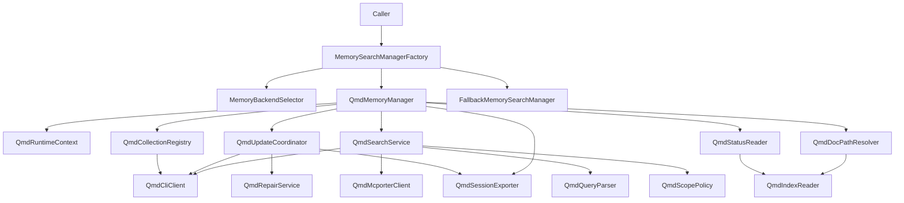
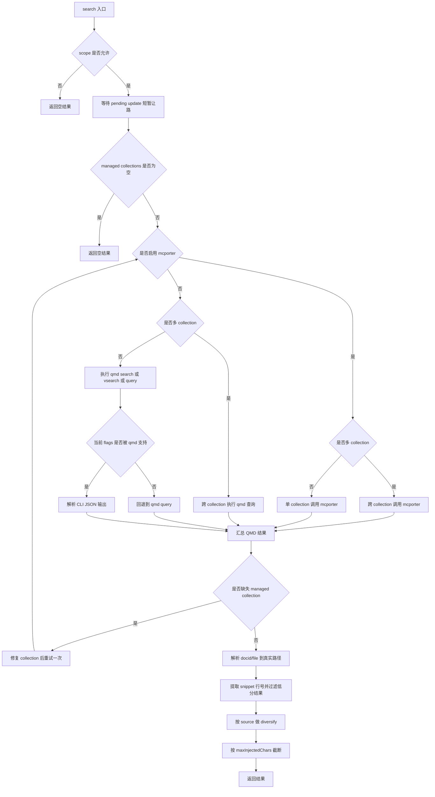
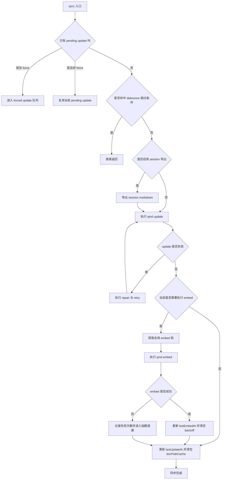

# Memory QMD Java 实现设计

## 1. 文档目标

本文基于以下两类材料整理：

- `docs/design/memory-architecture.md`
- `src/memory/qmd-manager.ts` 及其相关配套实现：
    - `src/memory/search-manager.ts`
    - `src/memory/backend-config.ts`
    - `src/memory/qmd-process.ts`
    - `src/memory/qmd-query-parser.ts`
    - `src/memory/qmd-scope.ts`
    - `src/memory/session-files.ts`

目标是为 Java 版 `QmdMemoryManager` 链路提供一份可以直接指导开发的设计文档，重点说明：

- QMD 路径涉及哪些类
- 每个类承担什么职责
- 每个类至少需要哪些方法
- 每个方法对应的逻辑流程是什么
- TypeScript 现有实现里有哪些关键行为必须在 Java 版保留

本文只覆盖 **QMD 后端链路**，重点是"外部工具驱动型 Memory 后端"在 Java 中如何落地。

---

## 2. 源码映射范围

| 主题 | TS 位置 | Java 目标 |
| - | - | - |
| 统一入口 | `src/memory/search-manager.ts` | `MemorySearchManagerFactory` / `FallbackMemorySearchManager` |
| backend 配置 | `src/memory/backend-config.ts` | `MemoryBackendSelector` / `QmdConfigResolver` |
| QMD 主 facade | `src/memory/qmd-manager.ts` | `QmdMemoryManager` |
| CLI 执行 | `src/memory/qmd-process.ts` | `QmdCliClient` / `QmdCommandRunner` |
| 查询 JSON 解析 | `src/memory/qmd-query-parser.ts` | `QmdQueryParser` |
| scope 校验 | `src/memory/qmd-scope.ts` | `QmdScopePolicy` |
| session 导出 | `src/memory/session-files.ts` | `QmdSessionExporter` |
| builtin 降级包装 | `src/memory/search-manager.ts` | `FallbackMemorySearchManager` |

---

## 3. QMD 路径的本质

QMD 路径与 builtin SQLite 路径的本质区别在于：

- builtin 是 **本地 schema 直写**
- QMD 是 **外部工具驱动 + agent 级隔离状态目录 + CLI / mcporter 调用**

因此 Java 版 QMD 实现不应该复用 `MemoryIndexRepository` 这类 builtin 风格组件，而应该围绕以下能力构建：

- 配置解析
- agent 级 QMD 运行时目录准备
- managed collections 管理
- QMD CLI / mcporter 调用
- query 结果解析
- `docid/file -> 真实文件路径` 解析
- `update/embed` 队列、退避、修复
- session transcript 导出为 markdown
- 故障修复与 builtin fallback

---

## 4. 推荐 Java 分层



### 4.1 设计原则

1. **QMD 是外部进程后端，不是本地 ORM 后端**。
2. **主 facade 只做协调，不直接塞满全部细节**。
3. **CLI 与 mcporter 是两条技术路径，必须分层**。
4. **collection 管理与 search 逻辑要拆开**。
5. **update/embed 需要有独立队列与退避逻辑**。
6. **doc path 解析应独立成单独组件**。
7. **QMD 故障修复要明确建模，而不是 scattered catch/retry**。
8. **QMD 后端失败后要允许自动降级到 builtin**。

---

## 5. QMD 总链路

### 5.1 搜索总链路



### 5.2 同步总链路



---

## 6. 统一入口与降级层

### 6.1 `MemorySearchManagerFactory`

#### 职责

根据 backend 配置创建 QMD manager，并在需要时包一层 builtin fallback wrapper。

#### 必须实现的方法

| 方法 | 说明 | 逻辑流程 |
| - | - | - |
| `MemorySearchManagerResult getManager(OpenClawConfig cfg, String agentId, Purpose purpose)` | 获取 Memory manager | 解析 backend -> 若 qmd 则创建 `QmdMemoryManager` -> 非 status 模式下包裹 fallback wrapper |
| `void closeAll()` | 关闭所有 manager | 关闭缓存中的 qmd manager 与 builtin manager |
| `String buildQmdCacheKey(String agentId, ResolvedQmdConfig config)` | cache key 构造 | `agentId + resolvedQmdConfig` 稳定序列化 |

#### `getManager()` 逻辑流程

1. 调用 `MemoryBackendSelector.resolve(...)`。
2. 如果 `backend != qmd`，直接走 builtin 路径。
3. 如果 `backend == qmd`：
    - `purpose=status`：直接创建 `QmdMemoryManager(status)`；
    - `purpose=default`：命中 QMD cache 则复用；否则创建新实例。
4. 创建成功后，使用 `FallbackMemorySearchManager` 包装：
    - primary = `QmdMemoryManager`
    - fallbackFactory = `MemoryIndexManager`
5. 如果 QMD 初始化失败，记录 warn，直接回落 builtin。

#### Java 建议

- QMD cache 应按 **agent + resolved qmd config** 维度缓存。
- 建议像 builtin 路径一样维护 pending manager future cache；同一 key 的并发创建只允许发生一次，失败时必须及时移除 pending entry。
- 失败的 wrapper 要可从 cache 中驱逐，确保下次能重新尝试创建 fresh QMD manager。

---

### 6.2 `FallbackMemorySearchManager`

#### 职责

包装 primary = QMD，fallback = builtin，在 QMD 初始化成功但运行中失败时自动切换。

#### 必须实现的方法

| 方法 | 说明 | 逻辑流程 |
| - | - | - |
| `search(...)` | 搜索降级入口 | 先走 QMD -> 若失败标记 primaryFailed -> close primary -> 切换 builtin |
| `readFile(...)` | 读文件降级 | 未失败时走 primary；失败后走 fallback |
| `status()` | 状态快照 | primary 正常时读 primary；失败后返回 fallback 状态并带 fallback 信息 |
| `sync(...)` | 同步降级 | primary 正常时走 QMD；失败后走 builtin |
| `probeEmbeddingAvailability()` | embedding 探针降级 | 优先 QMD，失败后转 builtin |
| `probeVectorAvailability()` | vector 探针降级 | 优先 QMD，失败后转 builtin |
| `close()` | 关闭资源 | 同时关闭 primary 与 fallback |
| `ensureFallback()` | 懒加载 fallback | 仅在 QMD 失败后初始化 builtin manager |

#### `search()` 逻辑流程

1. 如果 `primaryFailed=false`，先执行 `primary.search()`。
2. 如果 QMD 抛错：
    - 记录 `lastError`
    - `primaryFailed=true`
    - close QMD
    - 驱逐 cache entry
3. 懒加载 builtin fallback。
4. fallback 存在则执行 fallback search。
5. fallback 也不可用则抛 `memory search unavailable`。

#### 必须保留的语义

- `status()` 在降级后不能只返回 builtin 原始状态，必须补充 `fallback: { from: "qmd", reason }`。
- 降级切换涉及 `primaryFailed`、cache 驱逐、fallback 初始化三步，Java 版要保证并发安全。
- 同一个 wrapper 的 cache 驱逐只能发生一次；fallback 也应保证只懒加载一次，避免并发重复创建。
- primary 失败后，后续请求不应再继续命中同一个坏的 QMD 实例。

---

## 7. 配置层

### 7.1 `MemoryBackendSelector`

#### 职责

把原始 `memory.qmd` 配置解析为 Java 可直接消费的 `ResolvedQmdConfig`。

#### 必须实现的方法

| 方法 | 说明 | 逻辑流程 |
| - | - | - |
| `ResolvedMemoryBackendConfig resolve(OpenClawConfig cfg, String agentId)` | 解析 backend | 判断 backend 是否为 qmd -> 解析 collections / sessions / update / limits / mcporter |
| `ResolvedQmdMcporterConfig resolveMcporterConfig(...)` | 解析 mcporter 配置 | enabled / serverName / startDaemon 默认值归一化 |
| `ResolvedQmdSessionConfig resolveSessionConfig(...)` | 解析 session exporter 配置 | enabled / exportDir / retentionDays |
| `List<ResolvedQmdCollection> resolveDefaultCollections(...)` | 解析默认 memory collections | `MEMORY.md` / `memory.md` / `memory/**` |
| `List<ResolvedQmdCollection> resolveCustomPaths(...)` | 解析自定义 collections | 路径 normalize + 名称去重 |

#### 必须保留的配置语义

- `searchMode` 只允许 `search` / `vsearch` / `query`
- `includeDefaultMemory=false` 时不能自动加入默认 memory collections
- `mcporter.enabled=true` 且未显式配置 `startDaemon` 时，默认 `startDaemon=true`
- `scope` 要有默认 direct allow / default deny 语义

---

## 8. 主 facade 层

### 8.1 `QmdMemoryManager`

#### 职责

实现 `MemorySearchManager` 接口，作为 Java 版 QMD 后端总入口，负责协调：

- runtime 目录
- collections
- update/embed
- search
- doc path resolve
- session exporter
- status
- readFile

#### 推荐依赖

- `QmdRuntimeContext`
- `QmdCollectionRegistry`
- `QmdSearchService`
- `QmdUpdateCoordinator`
- `QmdDocPathResolver`
- `QmdSessionExporter`
- `QmdStatusReader`

#### 必须实现的方法

| 方法 | 说明 | 逻辑流程 |
| - | - | - |
| `static QmdMemoryManager create(...)` | 创建入口 | 校验 resolved.qmd 存在 -> 构造 manager -> `initialize(mode)` |
| `search(...)` | 搜索入口 | scope -> wait pending update -> run qmd/mcporter -> parse -> resolve path -> filter/diversify/clamp |
| `sync(...)` | 同步入口 | 进度回调 -> `runUpdate(reason, force)` |
| `readFile(...)` | 读文件 | 解析 workspace 路径或 `qmd/<collection>/...` 路径 -> 支持 partial read |
| `status()` | 状态快照 | 从 qmd index.sqlite 读取 documents 数量并汇总 sourceCounts |
| `probeEmbeddingAvailability()` | 探针 | 当前实现可直接返回 `{ok:true}` |
| `probeVectorAvailability()` | 探针 | 当前实现可直接返回 `true` |
| `close()` | 关闭 | 停 interval update -> 等待 pending/queued forced update -> 关闭 DB |
| `initialize(mode)` | 初始化 | bootstrap collections -> 目录准备 -> shared models symlink -> ensure collections -> boot update -> interval update |

#### `initialize()` 逻辑流程

1. `bootstrapCollections()`。
2. 如果 `mode=status`：
    - 不做 update，不做目录初始化，直接返回。
3. 创建 XDG config/cache/index 目录。
4. 如果启用 session exporter，创建导出目录。
5. 尝试 symlink shared models。
6. `ensureCollections()`。
7. 如果 `update.onBoot=true`：
    - 执行 boot update；
    - 若 `waitForBootSync=true`，等待完成；否则后台执行。
8. 如果 `update.intervalMs > 0`：
    - 建立 interval timer，周期触发 `runUpdate("interval")`。

#### Java 建议

- `QmdMemoryManager` 不应直接塞入所有 private helper；建议拆分到多个服务类。
- `mode=status` 是 QMD 路径的重要轻量初始化模式，Java 版必须保留。

---

## 9. Search 子链路

### 9.1 `QmdSearchService`

#### 职责

负责 QMD 查询执行本身，包括：

- scope 校验
- pending update 等待
- CLI / mcporter 分支选择
- fallback 到 `qmd query`
- 多 collection 聚合
- 缺失 collection repair + retry
- 结果过滤、打散、注入预算控制

#### 必须实现的方法

| 方法 | 说明 | 逻辑流程 |
| - | - | - |
| `List<MemorySearchResult> search(String query, SearchOptions opts)` | 总搜索入口 | scope -> normalize query -> collection check -> mcporter/cli -> parse -> doc resolve -> filter |
| `List<QmdQueryResult> runQueryAcrossCollections(...)` | CLI 多 collection workaround | 逐 collection 调 `qmd` -> 结果合并去重 |
| `List<QmdQueryResult> runMcporterAcrossCollections(...)` | mcporter 多 collection workaround | 逐 collection 调 mcporter -> 按 docid 聚合最高分 |
| `List<QmdQueryResult> runQmdSearchViaMcporter(...)` | 单次 mcporter 查询 | `mcporter call <server.tool>` -> parse structuredContent/results |
| `String[] buildSearchArgs(...)` | 构造 qmd CLI 参数 | 根据 `search/search/vsearch/query` 构造 argv |
| `String[] buildCollectionFilterArgs(...)` | 构造 collection filter 参数 | `-c <collection>` |
| `List<MemorySearchResult> diversifyResultsBySource(...)` | source 打散 | memory/sessions 交替输出 |
| `List<MemorySearchResult> clampResultsByInjectedChars(...)` | 注入预算截断 | 控制总 snippet 字符数 |
| `LineRange remapSessionLinesIfNeeded(...)` | session 行号回映射 | 读取 exporter sidecar / marker，把 markdown 行号映射回原始 `.jsonl` |
| `void waitForPendingUpdateBeforeSearch()` | 更新让路 | 最多等待一个很短的固定上限（建议 500ms），超时后继续搜索旧索引 |

#### `search()` 逻辑流程

1. `QmdScopePolicy.isAllowed(sessionKey)`。
2. 若不允许：
    - 记录 scope deny log
    - 返回空结果
3. `trim(query)`，空串返回空。
4. `waitForPendingUpdateBeforeSearch()`：
    - 最多等待一个很短的固定上限（建议 500ms，与 TS 保持一致）；
    - 超时后直接继续搜索当前索引，不长期阻塞请求。
5. 计算 `limit = min(config.maxResults, opts.maxResults)`。
6. 获取 managed collection names；为空则 warn 后返回空。
7. 根据 `mcporter.enabled` + `collectionNames.size` 选择查询路径：
    - mcporter + 单 collection
    - mcporter + 多 collection
    - CLI + 单 collection
    - CLI + 多 collection
8. CLI 单 collection 路径中，如果当前 `qmd search` / `qmd vsearch` 不支持 collection flags：
    - 通过 stderr / error message 中的 `unknown flag|unknown option|unknown argument` 等特征识别；
    - 自动 fallback 到 `qmd query`。
9. 若查询抛出"缺失 collection"错误：
    - 触发 repair
    - 重试一次
10. 对解析出的 `QmdQueryResult[]`：
    - `QmdDocPathResolver.resolveDocLocation(...)`
    - 提取 snippet 行号
    - 对 `sessions` source，若存在 line-map sidecar / marker，则回映射为原始 transcript `.jsonl` 行号；否则必须明确当前行号仅对应导出的 markdown
    - 过滤低于 `minScore` 的结果
11. `diversifyResultsBySource()`。
12. `clampResultsByInjectedChars()`。
13. 返回结果。

#### 必须保留的 QMD 搜索语义

- QMD 搜索不是简单"调一条命令"。
- 多 collection 时 TS 不是依赖 qmd 自带聚合，而是显式逐 collection 聚合；原因是跨 collection 的结果去重、分数可比性与 hints 保留都不够稳定，Java 版应按 `docid` 去重并保留最高分。
- `qmd search` / `vsearch` 参数不兼容时必须自动降级到 `qmd query`，并通过 stderr / error message contains 判断，不要依赖特定异常类型。
- 查询时允许最多等待一小段 pending update，但不能长期阻塞；建议固定上限 500ms，超时后继续使用旧索引搜索。

---

### 9.2 `QmdScopePolicy`

#### 职责

根据 `sessionKey` 和配置 scope 决定当前会话是否允许访问 QMD memory。

#### 必须实现的方法

| 方法 | 说明 | 逻辑流程 |
| - | - | - |
| `boolean isAllowed(SessionSendPolicyConfig scope, String sessionKey)` | 访问判定 | 解析 channel/chatType/normalizedKey -> 依规则匹配 -> 命中即 allow/deny |
| `String deriveChannel(String sessionKey)` | 提取 channel | 从 normalized session key 提取 channel |
| `ChatType deriveChatType(String sessionKey)` | 提取 chat type | `direct/group/channel` |
| `ParsedScope parseSessionScope(String sessionKey)` | 解析 scope 信息 | 兼容 raw key 与 normalized key |
| `String normalizeSessionKey(String sessionKey)` | 规范化 session key | 去 agent 前缀、lowercase、过滤 subagent |

#### `isAllowed()` 逻辑流程

1. 若 `scope=null`，默认允许。
2. 解析 `sessionKey` -> `channel/chatType/normalizedKey/rawKey`。
3. 遍历 `scope.rules`：
    - 匹配 `channel`
    - 匹配 `chatType`
    - 匹配 `keyPrefix` / `rawKeyPrefix`
4. 命中某条规则时，直接返回 allow/deny。
5. 无匹配规则时，返回 `scope.default`。

#### 必须保留的语义

- `sessionKey` 在 QMD 路径不是装饰参数，而是 access control 输入。
- `subagent:` session 必须被过滤掉。

---

### 9.3 `QmdQueryParser`

#### 职责

把 qmd CLI 的 stdout/stderr 解析为 `QmdQueryResult[]`，同时兼容 noisy output 与 no-results marker。

#### 必须实现的方法

| 方法 | 说明 | 逻辑流程 |
| - | - | - |
| `List<QmdQueryResult> parseQueryJson(String stdout, String stderr)` | 主解析入口 | no-results marker -> JSON array parse -> noisy output extract first array |
| `boolean isNoResultsOutput(String raw)` | 无结果识别 | 兼容 stdout/stderr marker |
| `String extractFirstJsonArray(String raw)` | noisy output 提取 | 找到第一个合法 JSON array |
| `String summarizeStderr(String raw)` | 日志摘要 | 截断 stderr 方便报错 |

#### `parseQueryJson()` 逻辑流程

1. trim stdout/stderr。
2. 若 stdout/stderr 是 `No results found` marker：返回空数组。
3. 若 stdout 为空：抛出 invalid JSON 错误。
4. 首先尝试 `JSON.parse(stdout)` 且要求 array。
5. 失败时从 noisy stdout 提取第一段 JSON array 再 parse。
6. 仍失败则抛出"qmd query returned invalid JSON"。

#### 必须保留的语义

- `No results found` 不应被当成异常。
- 一些 qmd 版本会输出额外噪音，Java 版必须兼容 noisy payload。

---

## 10. Update 子链路

### 10.1 `QmdUpdateCoordinator`

#### 职责

负责：

- update single-flight
- force update 排队
- debounce skip
- session exporter 驱动
- qmd update retry
- qmd embed 触发、全局串行锁、backoff
- 清理 docPathCache

#### 必须实现的方法

| 方法 | 说明 | 逻辑流程 |
| - | - | - |
| `void runUpdate(String reason, boolean force)` | update 总入口 | pending check -> queued forced update -> debounce -> export sessions -> qmd update -> maybe embed |
| `void runQmdUpdateWithRetry(String reason)` | update retry | boot 阶段最多多次重试，普通阶段一般一次 |
| `void runQmdUpdateOnce(String reason)` | 单次 update | 执行 qmd update，必要时 repair 后重试一次 |
| `boolean shouldSkipUpdate(boolean force)` | debounce 判定 | 比较 `lastUpdateAt` 与 `debounceMs` |
| `boolean shouldRunEmbed(boolean force)` | embed 判定 | 非 `search` mode，且未命中 backoff，且达到 embed interval |
| `void noteEmbedFailure(String reason, Throwable err)` | embed 失败退避 | failureCount++，指数退避 |
| `Promise<Void> enqueueForcedUpdate(String reason)` | force 队列 | 累加 forced runs 并排队 drain |
| `void drainForcedUpdates(String reason)` | force 队列消费 | 在 pending update 结束后串行执行 queued force updates |

#### `runUpdate()` 逻辑流程

1. 若 `closed=true`，返回。
2. 若 `pendingUpdate` 存在：
    - `force=true` -> 进入 forced queue
    - 否则复用当前 pending update
3. 若已有 queued forced update 且当前不是 fromForcedQueue：
    - `force=true` -> 再排队
    - 否则复用 queued forced update
4. 若 `shouldSkipUpdate(force)` 命中：返回。
5. 真正执行 update pipeline：
    - 如果启用 session exporter，则先 `exportSessions()`
    - 执行 `runQmdUpdateWithRetry(reason)`
    - 如果 `shouldRunEmbed(force)`，则进入 embed 阶段
6. embed 阶段：
    - 通过全局 `runWithQmdEmbedLock()` 串行化
    - 执行 `qmd embed`
    - 成功则更新 `lastEmbedAt` 并清理 backoff
    - 失败则 `noteEmbedFailure()`，但不让整个 sync 失败
7. 更新 `lastUpdateAt`。
8. 清空 `docPathCache`。

#### `runQmdUpdateWithRetry()` 逻辑流程

1. 若是 boot 阶段，可给更多 retry 次数。
2. 调 `runQmdUpdateOnce()`。
3. 若失败但属于 retryable error：
    - 按指数退避 sleep
    - 重试
4. 否则抛错。

#### `runQmdUpdateOnce()` 逻辑流程

1. 直接执行 `qmd update`。
2. 如果失败：
    - 先尝试 `null-byte collection repair`
    - 再尝试 `duplicate document constraint repair`
3. 任一 repair 成功后，再次执行一次 `qmd update`。
4. repair 也没命中则抛错。

#### 必须保留的语义

- `qmd embed` 失败不会让整个 update 必然失败，而是进入 backoff。
- force update 不应丢失，必须队列化。
- 同一时刻全局只允许一个 embed 执行，避免资源竞争。

---

### 10.2 `QmdSessionExporter`

#### 职责

把 agent transcript 导出为 QMD 可索引的 markdown，并维护导出状态与 retention 清理。

#### 必须实现的方法

| 方法 | 说明 | 逻辑流程 |
| - | - | - |
| `void exportSessions()` | 导出入口 | 列举 session files -> buildSessionEntry -> 渲染 markdown -> 增量写入 -> 清理 stale |
| `String renderSessionMarkdown(SessionFileEntry entry)` | 渲染 markdown | `# Session <id>` + content |
| `String pickSessionCollectionName()` | session collection 名称选择 | 优先 `sessions-<agentId>`，冲突时追加序号 |

#### `exportSessions()` 逻辑流程

1. 若未启用 exporter，返回。
2. 确保 exportDir 存在。
3. 列出当前 agent 全部 session `.jsonl`。
4. `buildSessionEntry()`。
5. 如果配置 retention 且 transcript 太旧，则跳过。
6. 目标文件名：`<session>.md`。
7. 对比 `hash + mtimeMs`：
    - 未变化则不重写
    - 变化则写 markdown
8. 若需要返回原始 transcript 行号，则同步写入 line-map sidecar / marker。
9. 记录 `exportedSessionState`。
10. 扫描 exportDir，删除已不再保留的 stale `.md` 及其 sidecar。
11. 清理 `exportedSessionState` 中无效条目。

#### 必须保留的语义

- QMD 不直接索引 `.jsonl` transcript，而是索引导出的 markdown。
- 导出是增量的，不要每次全量重写所有 session 文件。
- 如果 Java 版需要把搜索结果行号回到原始 transcript，就必须在导出链路额外持久化 `markdown line -> jsonl line` 的映射；否则文档里必须明确 session 结果行号只对应导出的 markdown。

---

## 11. Collection 管理与修复子链路

### 11.1 `QmdCollectionRegistry`

#### 职责

管理 QMD 的 managed collections，包括：

- default/custom/session collections bootstrap
- list existing
- add/remove/rebind
- legacy unscoped collection migration
- collection path ensure

#### 必须实现的方法

| 方法 | 说明 | 逻辑流程 |
| - | - | - |
| `void bootstrapCollections()` | 初始化 roots/source | 从 `ResolvedQmdConfig.collections` 构建 `collectionRoots` 与 `sources` |
| `void ensureCollections()` | 保证 collections 注册齐全 | list existing -> migrate legacy -> add/rebind/remove |
| `Map<String, ListedCollection> listCollectionsBestEffort()` | 尝试读取现有 collections | 优先 `qmd collection list --json`，不支持时忽略 |
| `boolean tryRebindConflictingCollection(...)` | 冲突重绑定 | path+pattern 已被别名占用时 remove old -> add desired |
| `void migrateLegacyUnscopedCollections(...)` | 老 collection 名称迁移 | 把未带 agent scope 的旧 collection 移除/迁移 |
| `void addCollection(...)` | 注册 collection | `qmd collection add <path> --name ... --mask ...` |
| `void removeCollection(String name)` | 删除 collection | `qmd collection remove` |
| `Map<String, ListedCollection> parseListedCollections(String output)` | 解析 collection list | 兼容 JSON 与 table 文本输出 |

#### `ensureCollections()` 逻辑流程

1. `listCollectionsBestEffort()`。
2. `migrateLegacyUnscopedCollections(existing)`。
3. 遍历期望的 managed collections：
    - 若 existing 中已存在且 path/pattern 无需 rebind，跳过
    - 若 existing 存在但需 rebind，先 remove
    - `ensureCollectionPath()`（目录 glob 场景创建目录）
    - 调 `addCollection()`
4. 如果 `addCollection()` 报"already exists"：
    - 尝试 `tryRebindConflictingCollection()`
5. 记录 warn，但整体尽量 best-effort。

#### 必须保留的语义

- `collection list --json` 在老版本 qmd 上可能不可用，Java 版必须兼容 best-effort 路径。
- `legacy unscoped collection` 指旧版本里未带 agent scope 的 collection 名称；迁移时应优先移除旧 collection，再创建带 scope 的新 collection，避免不同 agent 共享同一索引视图。
- 已有 collection metadata 不完整时不要轻易做 destructive rebind。

---

### 11.2 `QmdRepairService`

#### 职责

集中管理 QMD 特有故障修复逻辑。

#### 必须实现的方法

| 方法 | 说明 | 逻辑流程 |
| - | - | - |
| `boolean tryRepairMissingCollectionSearch(Throwable err)` | 搜索缺失 collection 修复 | 确认错误类型 -> `ensureCollections()` -> 重试一次 |
| `boolean tryRepairNullByteCollections(Throwable err, String reason)` | null byte 元数据修复 | rebuild managed collections -> 重试一次 |
| `boolean tryRepairDuplicateDocumentConstraint(Throwable err, String reason)` | duplicate document 修复 | rebuild managed collections -> 重试一次 |
| `void rebuildManagedCollectionsForRepair(String reason)` | 重建 collections | remove all managed -> add all managed |
| `boolean isMissingCollectionSearchError(Throwable err)` | 错误分类 | collection missing + search 场景 |
| `boolean shouldRepairNullByteCollectionError(Throwable err)` | 错误分类 | `ENOTDIR` / `not a directory` + null byte marker |
| `boolean shouldRepairDuplicateDocumentConstraint(Throwable err)` | 错误分类 | unique constraint on `(collection, path)` |

#### 必须保留的语义

- repair 通常只允许尝试一次，避免无限修复循环。
- repair 是 QMD 路径可用性的关键组成部分，不是附加优化。

---

## 12. 运行时与进程调用层

### 12.1 `QmdRuntimeContext`

#### 职责

为当前 agent 计算并持有 QMD 所需的所有运行时路径和环境变量。

#### 必须包含的核心字段

- `workspaceDir`
- `stateDir`
- `agentStateDir`
- `qmdDir`
- `xdgConfigHome`
- `xdgCacheHome`
- `indexPath`
- `Map<String, String> env`
- `SessionExporterConfig sessionExporter`

#### 必须实现的方法

| 方法 | 说明 | 逻辑流程 |
| - | - | - |
| `QmdRuntimeContext create(...)` | 运行时上下文初始化 | 计算路径 -> 组装 env -> 追加 session collection |
| `void symlinkSharedModels()` | 共享模型目录 | 将默认 `~/.cache/qmd/models` 链接到 agent 级 cache |
| `String sanitizeCollectionNameSegment(String input)` | collection 名称片段规范化 | 小写化、去非法字符、trim |

#### 必须保留的语义

- QMD 要求 agent 级隔离的 XDG config/cache。
- 但 models 目录希望共享，避免每个 agent 反复下载。

---

### 12.2 `QmdCliClient`

#### 职责

负责所有直接 `qmd` CLI 调用。

#### 必须实现的方法

| 方法 | 说明 | 逻辑流程 |
| - | - | - |
| `CliResult runQmd(List<String> args, CommandOptions opts)` | 运行 qmd 命令 | 构造 spawn invocation -> 传 env/cwd/timeout/output cap -> 返回 stdout/stderr |
| `CliSpawnInvocation resolveCliSpawnInvocation(...)` | Windows/跨平台 spawn 解析 | 解析真正 command + argv |

#### 必须保留的语义

- `qmd update` 这类高输出命令需要支持 `discardStdout`，否则容易触发输出上限。
- `cwd` 必须是 workspaceDir。
- `env` 必须带上 agent 级 XDG 环境。

---

### 12.3 `QmdMcporterClient`

#### 职责

负责所有 `mcporter` 相关调用。

#### 必须实现的方法

| 方法 | 说明 | 逻辑流程 |
| - | - | - |
| `void ensureDaemonStarted(ResolvedQmdMcporterConfig cfg)` | daemon 热启动控制 | startDaemon=false 时仅 warn；否则全局单例启动 daemon |
| `CliResult runMcporter(List<String> args, CommandOptions opts)` | 执行 mcporter | spawn mcporter 命令 |
| `List<QmdQueryResult> runSearchViaMcporter(...)` | 调用 qmd MCP tool | `mcporter call <server.tool> --args ... --output json` |

#### 必须保留的语义

- `startDaemon=false` 时不能强行起 daemon，但应 warn 说明可能 cold-start。
- daemon 启动要全局单例化，避免多个 manager 并发起 daemon。

---

## 13. Path 解析与状态读取层

### 13.1 `QmdDocPathResolver`

#### 职责

把 QMD 查询结果中的 `docid` / `collection` / `file` 映射回 OpenClaw 需要展示的真实文档路径。

#### 必须实现的方法

| 方法 | 说明 | 逻辑流程 |
| - | - | - |
| `DocLocation resolveDocLocation(String docid, DocHints hints)` | 主解析入口 | 优先查 cache -> 查 qmd index.sqlite -> 结合 hints 选最优 location |
| `DocLocation resolveDocLocationFromHints(DocHints hints)` | 仅用 hints 解析 | 从 collection + file 推导 relative path |
| `DocHints normalizeDocHints(DocHints hints)` | 规范化 hints | 解析 `qmd://` URI |
| `ParsedFileUri parseQmdFileUri(String fileRef)` | 解析 qmd:// URI | hostname -> collection, pathname -> relative path |
| `String toCollectionRelativePath(String collection, String filePath)` | 计算 collection 内相对路径 | 基于 collection root 计算相对路径 |
| `DocLocation pickDocLocation(List<DocRow> rows, DocHints hints)` | 多行选择策略 | 优先 collection 匹配 -> file 匹配 -> 取第一行 |
| `DocLocation toDocLocation(String collection, String relativePath)` | 转换为 DocLocation | 计算 abs path 与 workspace relative path |

#### `resolveDocLocation()` 逻辑流程

1. 规范化 hints。
2. 若 `docid` 为空，走 `resolveDocLocationFromHints()`。
3. 检查 docPathCache。
4. 查询 `qmd/index.sqlite` 的 `documents` 表：
    - `SELECT collection, path FROM documents WHERE hash = ? AND active = 1`
    - 若无结果，尝试 `LIKE` 前缀匹配
5. 若查询抛 `SQLITE_BUSY`：
    - 记录 debug log
    - 抛出"qmd index busy"错误
6. 用 `pickDocLocation()` 选择最优 location。
7. 写入 cache 并返回。

#### 必须保留的语义

- `docid` 通常来自 QMD 的 hash，而不是文件路径本身。
- `qmd://<collection>/<path>` 是 QMD 特有 URI 格式，Java 版必须解析。
- 缓存对性能很重要，避免每次 search 都查 SQLite。

---

### 13.2 `QmdIndexReader`

#### 职责

只读访问 `qmd/index.sqlite`，提供 documents 统计与 docid 解析能力。

#### 必须实现的方法

| 方法 | 说明 | 逻辑流程 |
| - | - | - |
| `SqliteDatabase ensureDb()` | 懒加载 DB 连接 | 打开 index.sqlite (readOnly) -> 设置 busy_timeout |
| `CountsResult readCounts()` | 读取 documents 统计 | `SELECT collection, COUNT(*) FROM documents WHERE active=1 GROUP BY collection` |
| `List<DocRow> queryDocRowsByHash(String hash)` | 按 hash 查询文档 | 精确匹配 + 前缀匹配 fallback |

#### 必须保留的语义

- QMD index DB 会在 update/embed 期间被写进程锁定。
- 读连接应设置合理的 `busy_timeout`。
- 不要在搜索路径持有长事务。

---

### 13.3 `QmdStatusReader`

#### 职责

为 `QmdMemoryManager.status()` 提供状态快照。

#### 必须实现的方法

| 方法 | 说明 | 逻辑流程 |
| - | - | - |
| `MemoryProviderStatus buildStatus()` | 构建状态快照 | 调用 `readCounts()` -> 组装 status 对象 |

#### `status()` 输出结构

```json
{
  "backend": "qmd",
  "provider": "qmd",
  "model": "qmd",
  "files": 123,
  "chunks": 123,
  "dirty": false,
  "workspaceDir": "/path/to/workspace",
  "dbPath": "/path/to/qmd/index.sqlite",
  "sources": ["memory", "sessions"],
  "sourceCounts": [
    { "source": "memory", "files": 100, "chunks": 100 },
    { "source": "sessions", "files": 23, "chunks": 23 }
  ],
  "vector": { "enabled": true, "available": true },
  "custom": {
    "qmd": {
      "collections": 5,
      "lastUpdateAt": 1709876543210
    }
  }
}
```

#### 状态结构补充约束

- `QmdStatusReader` 对上仍应复用统一的 `MemoryProviderStatus` DTO 顶层字段，保证与 builtin 路径可并排消费。
- sqlite 特有的 `fts` / `cache` 等字段在 QMD 路径可以省略或只填最小必要值，但不要伪造不存在的运行时能力。
- `fallback` 信息应由 `FallbackMemorySearchManager` 在降级后统一注入，而不是由 `QmdStatusReader` 自己伪造。

---

## 14. readFile 实现

### 14.1 `QmdMemoryManager.readFile()`

#### 职责

读取 memory 文件内容，支持：

- workspace relative path
- `qmd/<collection>/<relative>` 形式的路径
- partial read (`from` + `lines`)

#### 逻辑流程

1. trim `relPath`，空串抛错。
2. 解析路径：
    - 若以 `qmd/` 开头：
        - 提取 collection + relative path
        - 从 `collectionRoots` 获取 root path
        - 校验不越界
    - 否则作为 workspace relative path
3. 校验 `.md` 后缀。
4. 若 `from` 或 `lines` 存在：
    - `readPartialText(absPath, from, lines)`
5. 否则：
    - `readFullText(absPath)`
6. 文件不存在时返回 `{text: "", path: relPath}`。

#### 必须保留的语义

- 不存在的文件应返回空文本，而不是抛错。
- partial read 应高效，不能每次读全文件再切片。

---

## 15. 关键错误分类

QMD 路径的错误不是简单的"成功/失败"，而是需要细粒度分类以决定是否 repair/retry/fallback。

### 15.1 错误类型

| 错误类型 | 识别方法 | 处理策略 |
| - | - | - |
| missing collection search error | `isCollectionMissingError` + search 场景 | repair collections -> retry once |
| null byte collection error | `ENOTDIR` + null byte marker | rebuild managed collections -> retry once |
| duplicate document constraint | `unique constraint failed` + `documents.collection/path` | rebuild managed collections -> retry once |
| sqlite busy | `SQLITE_BUSY` / `database is locked` | 可 retry，带 backoff |
| unsupported qmd option | `unknown flag/option/argument` | fallback to `qmd query` |
| generic qmd failure | 其他错误 | 视场景：search 失败触发 fallback wrapper，update 失败记录 warn |

### 15.2 Java 建议

- 不要用 `instanceof` 匹配错误，应该用 `message contains` 这种稳健方式。
- 所有 repair 动作必须有限制（如只允许一次），避免无限循环。

---

## 16. 总结：Java 实现检查清单

### 16.1 必须实现的核心类

1. `MemorySearchManagerFactory` - 统一工厂 + QMD cache
2. `FallbackMemorySearchManager` - QMD -> builtin 自动降级
3. `MemoryBackendSelector` - backend 配置解析
4. `QmdMemoryManager` - QMD 主 facade
5. `QmdRuntimeContext` - agent 级运行时目录与环境
6. `QmdCollectionRegistry` - managed collections 管理
7. `QmdSearchService` - 搜索执行 + 多路径分支
8. `QmdScopePolicy` - sessionKey 访问控制
9. `QmdQueryParser` - qmd JSON 输出解析
10. `QmdUpdateCoordinator` - update/embed 队列与退避
11. `QmdSessionExporter` - transcript -> markdown 导出
12. `QmdDocPathResolver` - docid -> 文件路径解析
13. `QmdIndexReader` - qmd index.sqlite 只读访问
14. `QmdStatusReader` - 状态快照构建
15. `QmdCliClient` - qmd CLI 进程调用
16. `QmdMcporterClient` - mcporter MCP 桥接
17. `QmdRepairService` - QMD 特有故障修复

### 16.2 必须保留的关键行为

- QMD 搜索前先做 scope 校验
- 多 collection 时必须手动聚合，不依赖 qmd 自带跨 collection 能力
- `qmd search` / `vsearch` 不支持 collection flags 时自动降级到 `qmd query`
- 搜索时短暂等待 pending update，但不长期阻塞
- 搜索失败时 repair missing collection 并重试一次
- update 失败时尝试 null-byte / duplicate document repair
- embed 失败进入指数退避，但不让整个 sync 失败
- force update 必须队列化，不能丢失
- session 导出是增量的，依赖 hash + mtime 变化检测
- docid 解析依赖 qmd index.sqlite，必须有 cache
- QMD manager 必须按 agent + resolved config 缓存
- QMD 初始化失败或运行中失败时自动降级到 builtin
- `mode=status` 必须是轻量初始化，不执行 update

### 16.3 与 builtin 路径的关键区别

- 不复用 `MemoryIndexRepository`
- 不直接写 SQLite schema
- 依赖外部进程调用
- 需要 agent 级隔离的 XDG 状态目录
- 需要 models 目录共享 symlink
- 需要 session transcript 导出为 markdown
- 需要 QMD 特有的 repair 逻辑
- 需要与 builtin fallback 协同

---

## 17. 参考文档

- docs/design/memory-architecture.md
- docs/design/memory-sqllite-impl.md (builtin 路径)
- https://docs.openclaw.ai/configuration (配置参考)