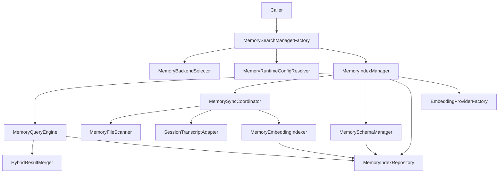
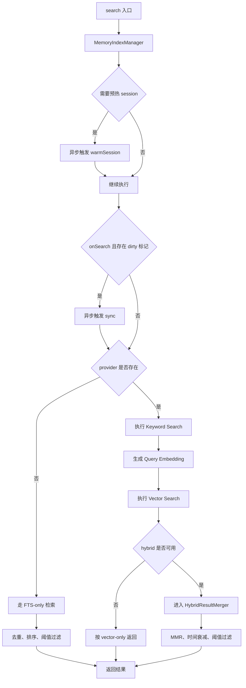
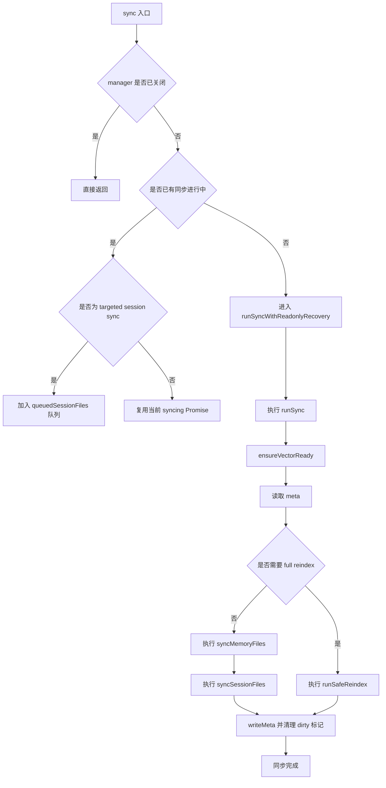

# Memory SQLite Java 实现设计

## 1. 文档目标

本文基于以下两类材料整理：

- `docs/design/memory-architecture.md`
- `src/memory/**/*.ts` 的 TypeScript 真实实现

目标不是简单复述 TS 代码，而是给出一份可直接指导 Java 落地的 `MemorySearch` SQLite 链路开发说明，重点回答：

- Java 版 `MemorySearch` 链路应该拆成哪些类
- 每个类要承担什么职责
- 每个类至少要有哪些方法
- 每个方法的逻辑流程应该如何组织
- 哪些行为是 TS 版本里必须保留的语义

本文只覆盖 **builtin / sqlite** 路径，但会保留统一入口层设计，这样后续如果继续兼容 `qmd`，不会推倒重来。

---

## 2. 源码映射范围

| 主题 | TS 位置 | Java 目标 |
| - | - | - |
| 统一入口 | `src/memory/search-manager.ts` | 工厂、缓存、统一接口 |
| builtin facade | `src/memory/manager.ts` | `MemoryIndexManager` |
| 搜索执行 | `src/memory/manager-search.ts` | `MemoryQueryEngine` |
| 同步与重建 | `src/memory/manager-sync-ops.ts` | `MemorySyncCoordinator` |
| embedding 建索引 | `src/memory/manager-embedding-ops.ts` | `MemoryEmbeddingIndexer` |
| schema | `src/memory/memory-schema.ts` | `MemorySchemaManager` |
| 文件扫描与 chunk | `src/memory/internal.ts` | `MemoryFileScanner` / `MarkdownChunker` |
| session 适配 | `src/memory/session-files.ts` | `SessionTranscriptAdapter` |
| hybrid 合并 | `src/memory/hybrid.ts` | `HybridResultMerger` |
| embedding provider | `src/memory/embeddings.ts` | `EmbeddingProviderFactory` |
| runtime config | `src/agents/memory-search.ts` | `MemoryRuntimeConfigResolver` |
| backend 选择 | `src/memory/backend-config.ts` | `MemoryBackendSelector` |

---

## 3. Java 版推荐分层



### 3.1 核心设计原则

1. **入口统一**：上层只依赖 `MemorySearchManager`。
2. **builtin 是组合对象，不是巨型类**：`MemoryIndexManager` 只做 facade。
3. **搜索与同步分离**：查询不能依赖同步实现细节。
4. **SQLite 细节下沉**：SQL、schema、向量表、FTS 表不要散落在 facade。
5. **支持 FTS-only 模式**：没有 embedding provider 也要能工作。
6. **同步要 single-flight**：同一时刻只允许一个主同步任务运行。
7. **重建要原子切换**：正式实现必须支持 temp DB + swap。
8. **Session memory 要独立适配**：不能把 `.jsonl` 当普通 Markdown 文件处理。

---

## 4. MemorySearch SQLite 链路总览

### 4.1 搜索总链路



### 4.2 同步总链路



---

## 5. 统一接口层

## 5.1 `MemorySearchManager`

### 职责

统一定义 Memory 搜索系统的对外能力，不暴露 SQLite、FTS、向量、watcher、provider 细节。

### 必须实现的方法

| 方法 | 说明 | 逻辑流程 |
| - | - | - |
| `List<MemorySearchResult> search(String query, SearchOptions options)` | 统一检索入口 | 校验参数 -> 必要时触发异步预热/同步 -> 调用查询链路 -> 过滤并返回 |
| `ReadFileResult readFile(ReadFileRequest request)` | 读取 memory 文件片段 | 校验路径 -> 校验作用域 -> 读取文件 -> 根据行号裁剪 |
| `MemoryProviderStatus status()` | 返回状态快照 | 汇总 index / provider / vector / cache / batch / dirty / fallback |
| `void sync(SyncRequest request)` | 同步索引 | single-flight -> 增量同步或 full reindex |
| `MemoryEmbeddingProbeResult probeEmbeddingAvailability()` | 探测 embedding 是否可用 | FTS-only 返回不可用原因；否则发起轻量 embedding 请求 |
| `boolean probeVectorAvailability()` | 探测 vector 是否可用 | 检查配置 + 加载 sqlite-vec + 维度准备 |
| `void close()` | 释放资源 | 停止 watcher/timer -> 等待在途同步 -> 关闭 DB |

### Java 建议

- 这是面向业务层的唯一接口。
- 统一返回 DTO，不向上抛出 SQLite 特有类型。
- 所有异常尽量转为业务可理解消息。

---

## 5.2 关键 DTO / Value Object

这部分不是执行类，但必须先定义，否则链路无法稳定落地。

### `SearchOptions`

建议字段：

- `Integer maxResults`
- `Double minScore`
- `String sessionKey`

### `ReadFileRequest`

建议字段：

- `String relPath`
- `Integer from`
- `Integer lines`

### `SyncRequest`

建议字段：

- `String reason`
- `boolean force`
- `List<String> sessionFiles`
- `Consumer<MemorySyncProgressUpdate> progress`

### `MemorySearchResult`

建议字段：

- `String path`
- `int startLine`
- `int endLine`
- `double score`
- `String snippet`
- `MemorySource source`
- `String citation`

### `MemoryProviderStatus`

建议字段：

- `String backend`
- `String provider`
- `String model`
- `String requestedProvider`
- `Integer files`
- `Integer chunks`
- `Boolean dirty`
- `String workspaceDir`
- `String dbPath`
- `List<String> extraPaths`
- `List<MemorySource> sources`
- `List<SourceCount>`
- `CacheStatus cache`
- `FtsStatus fts`
- `VectorStatus vector`
- `BatchStatus batch`
- `FallbackStatus fallback`
- `Map<String, Object> custom`

### 必须保留的语义

- `status()` 不是静态配置视图，而是 **运行时快照**。
- `MemorySearchResult.score` 必须是归一化后可排序的数值。
- `source` 必须明确区分 `memory` 和 `sessions`。
- QMD 路径也应复用同一个 `MemoryProviderStatus` 顶层 DTO；sqlite 特有子结构（如 `fts` / `cache`）允许在其它后端省略，但不要把接口拆成两套不兼容模型。

---

## 6. 入口与配置层

## 6.1 `MemorySearchManagerFactory`

### 职责

统一构造并缓存当前 agent 的 `MemorySearchManager`。在 SQLite 版本中，它最终返回 `MemoryIndexManager`；未来如接回 `qmd`，这里仍是唯一入口。

### 推荐依赖

- `MemoryBackendSelector`
- `MemoryRuntimeConfigResolver`
- `EmbeddingProviderFactory`
- manager cache

### 必须实现的方法

| 方法 | 说明 | 逻辑流程 |
| - | - | - |
| `MemorySearchManagerResult getManager(OpenClawConfig cfg, String agentId, Purpose purpose)` | 获取 manager | 解析 backend -> 如果当前阶段只做 sqlite，则固定 builtin -> 解析 runtime config -> 构造 cacheKey -> 命中缓存直接返回 -> 未命中则创建并缓存 |
| `void closeAll()` | 关闭所有 manager | 拿到缓存中实例 -> 逐个调用 `close()` -> 清空缓存 |
| `String buildCacheKey(...)` | 保证相同 agent + workspace + config 复用实例 | 序列化 agentId + workspaceDir + resolvedConfig |

### `getManager()` 逻辑流程

1. 调用 `MemoryBackendSelector.resolve(cfg, agentId)`。
2. 若当前 Java 阶段仅实现 SQLite：
    - 对 `backend=qmd` 可先记录“暂不支持”或退化到 builtin。
3. 调用 `MemoryRuntimeConfigResolver.resolve(cfg, agentId)`。
4. 若配置解析结果为 disabled，返回 `manager=null`。
5. 生成 cache key：`agentId + workspaceDir + resolvedConfig`。
6. 若缓存中已有 manager，直接返回。
7. 若已有 pending 创建任务，等待该任务。
8. 调用 `EmbeddingProviderFactory.create(...)` 获取 provider。
9. 创建 `MemoryIndexManager`。
10. 放入缓存并返回。

### 开发注意点

- 要有 **pending promise / future cache**，避免高并发下重复初始化。
- pending cache 的 key 必须与正式 manager cache 一致；同一 key 的并发请求应返回同一个 future，而不是各自重新初始化。
- pending 创建失败后必须立即移除 pending entry；只有真正创建成功后才能写入正式 manager cache。
- `purpose=status` 时仍需能构造轻量 manager，以便返回状态。

---

## 6.2 `MemoryBackendSelector`

### 职责

把原始配置转换为“最终应该走哪个后端”的结果。

### 必须实现的方法

| 方法 | 说明 | 逻辑流程 |
| - | - | - |
| `ResolvedMemoryBackendConfig resolve(OpenClawConfig cfg, String agentId)` | 决定 backend | 读取 `cfg.memory.backend` -> 默认 builtin -> 若是 qmd，补齐 qmd 配置并返回 |

### Java 实现建议

即使当前只做 SQLite，也要保留这个类。原因：

- 避免未来把 backend 判定逻辑散落到 factory
- `citations`、`scope`、`collections` 这类后续扩展位需要统一出口

---

## 6.3 `MemoryRuntimeConfigResolver`

### 职责

把默认配置和 agent 级覆盖配置合并成 `ResolvedMemorySearchConfig`，并完成所有 normalize / clamp / validate。

### 必须实现的方法

| 方法 | 说明 | 逻辑流程 |
| - | - | - |
| `ResolvedMemorySearchConfig resolve(OpenClawConfig cfg, String agentId)` | 解析运行时配置 | 读取 defaults + overrides -> merge -> clamp -> validate -> 返回不可变对象 |
| `List<MemorySource> normalizeSources(...)` | 规范化 source | 默认 `memory`；只有启用 session memory 才允许 `sessions` |
| `String resolveStorePath(...)` | 解析 SQLite 路径 | 支持 `{agentId}` 占位符、绝对路径、用户路径展开 |
| `void validateMultimodalConfig(...)` | 校验 multimodal | 若开启 multimodal，必须校验 provider/model/fallback 组合是否合法 |

### `resolve()` 逻辑流程

1. 读取 `agents.defaults.memorySearch`。
2. 读取 `agents.<agentId>.memorySearch`。
3. 合并 provider、fallback、store、query、sync、cache、multimodal 等配置。
4. 对 `minScore`、`candidateMultiplier`、`chunkOverlap`、`halfLifeDays` 做 clamp。
5. 归一化 `vectorWeight` / `textWeight`，保证总和为 1。
6. 解析 `extraPaths`，去重。
7. 校验 multimodal 前置条件。
8. 若 `enabled=false`，返回 `null` 或 `disabled config`。

### 必须保留的 TS 语义

- `provider=auto` 合法。
- `provider` 不可用时允许进入 **FTS-only mode**。
- `sources` 默认不能隐式包含 `sessions`，只有显式开启才行。

### 合并语义约定

- `defaults` 与 `agent overrides` 应做 **按对象递归的深合并**，不是整段浅覆盖。
- 标量字段（如 `minScore`、`provider`）由 agent override 覆盖 defaults。
- 对象字段（如 `query.hybrid`、`sync`、`cache`）只覆盖显式提供的子字段，未提供的子字段继续继承 defaults。
- 数组字段（如 `extraPaths`、`sources`）应按配置语义单独处理：通常以 override 为准，再做 normalize / dedupe，而不是简单拼接。
- 文档中最好给一个示例：`defaults.query.hybrid.enabled=true`，agent 仅把 `enabled=false` 覆盖时，其余 hybrid 配置仍然继承 defaults。

---

## 7. Builtin Facade 层

## 7.1 `MemoryIndexManager`

### 职责

这是 Java builtin 路径的总入口 facade，对上实现 `MemorySearchManager`，对下协调查询、同步、schema、repository、provider、watcher。

### 推荐依赖

- `ResolvedMemorySearchConfig settings`
- `EmbeddingProvider provider`
- `MemoryQueryEngine queryEngine`
- `MemorySyncCoordinator syncCoordinator`
- `MemoryIndexRepository repository`
- `MemorySchemaManager schemaManager`

### 必须实现的方法

| 方法 | 说明 | 逻辑流程 |
| - | - | - |
| `search(...)` | 搜索入口 | session 预热 -> onSearch 时异步 sync -> 调用 queryEngine |
| `sync(...)` | 同步入口 | single-flight -> readonly recovery -> 调用 syncCoordinator |
| `readFile(...)` | 读文件 | 校验 path -> 限制只读 memory 范围 -> 返回文本 |
| `status()` | 状态汇总 | repository 统计 + provider/vector/batch/dirty 汇总 |
| `probeEmbeddingAvailability()` | embedding 探针 | FTS-only 返回原因；否则发起轻量 embed |
| `probeVectorAvailability()` | vector 探针 | vector 开关关闭直接 false；否则 ensure vector ready |
| `close()` | 资源关闭 | 停 timer/watcher -> 等待同步 -> 关闭 sqlite |
| `warmSession(String sessionKey)` | 会话预热 | 仅首次 session start 异步触发 sync |

### `search()` 逻辑流程

1. `trim(query)`，空串直接返回空列表。
2. 若配置开启 `onSessionStart`：
    - 调用 `warmSession(sessionKey)`。
    - 注意：**预热是异步触发，不阻塞本次 search**。
3. 若配置 `sync.onSearch=true` 且 `dirty || sessionsDirty`：
    - 异步触发 `sync(reason=search)`。
    - 注意：**不等待同步完成**。
4. 计算 `minScore`、`maxResults`、`candidateCount`。
5. 委派给 `MemoryQueryEngine.search(...)`。
6. 返回结果。

### `sync()` 逻辑流程

1. 若 `closed=true`，直接返回。
2. 若当前已有 `syncingFuture`：
    - 如果 request 是 targeted session sync，则交给队列；
    - 否则复用当前 future。
3. 若没有在途同步，创建新的 `syncingFuture`。
4. 调用 `runSyncWithReadonlyRecovery(request)`。
5. 结束后清空 `syncingFuture`。

### `readFile()` 逻辑流程

1. 校验 `relPath` 非空。
2. 把相对路径解析到 workspace。
3. 判断是否属于允许范围：
    - `MEMORY.md`
    - `memory.md`
    - `memory/**`
    - `extraPaths`
4. 仅允许 `.md` 文件。
5. 若文件不存在，返回空文本而不是硬异常。
6. 若指定 `from/lines`，按行切片。
7. 返回 `{path, text}`。

### `status()` 逻辑流程

1. 查询 `files/chunks` 总数。
2. 按 source 统计分布。
3. 汇总 provider/model/requestedProvider。
4. 汇总 cache/fts/vector/batch 状态。
5. 汇总 `dirty`、`fallbackReason`、`providerUnavailableReason`。
6. 把只读恢复统计写入 `custom.readonlyRecovery`。

### 必须保留的行为

- `search()` 不能因为同步还没跑完而阻塞。
- `status()` 必须包含 FTS-only / hybrid 模式信息。
- `close()` 必须尽量温和，不能直接丢弃在途同步。

---

## 8. 查询子链路

## 8.1 `MemoryQueryEngine`

### 职责

封装 query -> keyword search -> vector search -> hybrid merge 的完整检索路径。

### 推荐依赖

- `MemoryIndexRepository`
- `HybridResultMerger`
- `EmbeddingProvider`
- `ResolvedMemorySearchConfig`
- `VectorExtensionManager`（可选）

### 必须实现的方法

| 方法 | 说明 | 逻辑流程 |
| - | - | - |
| `List<MemorySearchResult> search(String query, SearchOptions options)` | 总查询入口 | 根据 provider/fts/vector 状态选择 FTS-only / vector-only / hybrid |
| `List<SearchRowResult> searchKeyword(String query, int limit)` | FTS 检索 | 构建 FTS query -> 执行 BM25 -> rank 转 score |
| `List<SearchRowResult> searchVector(float[] queryVector, int limit)` | 向量检索 | 优先 sqlite-vec；失败时降级为内存余弦相似度 |
| `String buildFtsQuery(String raw)` | 构建 FTS 表达式 | 抽 token -> 转为 `"token1" AND "token2"` |
| `double bm25RankToScore(double rank)` | BM25 分数归一化 | 统一转为 0~1 可比较分值 |

### `search()` 逻辑流程

#### 场景 A：FTS-only 模式（provider 为空）

1. 检查 FTS 是否启用且可用。
2. 用 `extractKeywords()` 抽取关键词。
3. 逐个关键词调用 `searchKeyword()`。
4. 按 chunk id 去重，保留最高分。
5. 排序、过滤 `minScore`、裁剪 `maxResults`。
6. 返回结果。

#### 场景 B：provider 存在，但 FTS 不可用

1. 对 query 生成 embedding。
2. 调用 `searchVector()`。
3. 只返回向量结果。

#### 场景 C：provider 存在且 hybrid 可用

1. 执行 `searchKeyword()`。
2. 执行 `embedQuery()`。
3. 执行 `searchVector()`。
4. 交给 `HybridResultMerger.merge(...)`。
5. 若严格 `minScore` 过滤后仍有结果，直接返回。
6. 若没有严格结果，但 keyword results 存在：
    - 放宽到 `min(minScore, textWeight)`；
    - 这样做的原因是 keyword-only 命中的理论最高分通常就是 `textWeight`，如果 `minScore > textWeight`，会把本来很准的纯关键词命中全部误杀；
    - 只放宽过滤阈值，不重写原始分数，也不额外做第二轮重排；
    - 保留 keyword-only 命中的结果。
7. 返回结果。

### `searchVector()` 逻辑流程

1. 若 query vector 为空，直接返回空。
2. 先调用 `ensureVectorReady(dimensions)`。
3. 若 sqlite-vec 可用：
    - 在 `chunks_vec` 上执行 cosine distance 查询；
    - join `chunks` 获取 path/snippet/source。
4. 若 sqlite-vec 不可用：
    - 扫描当前 model 的 chunks；
    - 逐条读取 embedding JSON；
    - 用内存计算 cosine similarity；
    - 排序取 top N。

### `searchKeyword()` 逻辑流程

1. `buildFtsQuery(raw)`。
2. 若无 token，返回空。
3. 在 `chunks_fts` 执行 MATCH。
4. 用 `bm25()` 排序。
5. 转为 0~1 score。
6. 裁剪 snippet 长度。

### 必须保留的 TS 语义

- provider 为空不算异常，而是合法 FTS-only 模式。
- vector search 必须有 fallback：sqlite-vec 不可用时仍能用内存扫描。
- hybrid 模式对 keyword-only 精确命中要有放宽阈值逻辑。

---

## 8.2 `HybridResultMerger`

### 职责

把 keyword 命中和 vector 命中融合成统一结果，并应用 MMR 与时间衰减。

### 必须实现的方法

| 方法 | 说明 | 逻辑流程 |
| - | - | - |
| `List<MemorySearchResult> merge(HybridMergeRequest request)` | 结果融合 | 按 id 合并 -> 权重加权 -> 时间衰减 -> 排序 -> 可选 MMR |
| `double combineScore(double vectorScore, double textScore, ...)` | 线性融合 | `vectorWeight * vectorScore + textWeight * textScore` |
| `List<MemorySearchResult> applyTemporalDecay(...)` | 时间衰减 | 根据文件时间/半衰期调整分数 |
| `List<MemorySearchResult> applyMmr(...)` | 多样性重排 | 降低重复/高度相似片段扎堆 |

### `merge()` 逻辑流程

1. 以 `chunk id` 为主键合并 keyword/vector 结果。
2. 缺失侧分数按 0 处理。
3. 计算线性融合分数。
4. 应用 temporal decay（如果启用）。
5. 按分数降序排序。
6. 应用 MMR（如果启用）。
7. 输出统一 `MemorySearchResult`。

### Java 建议

- 不要把 MMR 和 temporal decay 写死在 query engine 中。
- 这个类保持纯函数化，方便单测。

---

## 9. 同步与重建子链路

## 9.1 `MemorySyncCoordinator`

### 职责

负责 watcher、dirty 标记、session delta、增量同步、full reindex、只读恢复、meta 判定、进度回调。

### 推荐依赖

- `MemoryIndexRepository`
- `MemoryFileScanner`
- `SessionTranscriptAdapter`
- `MemoryEmbeddingIndexer`
- `MemorySchemaManager`

### 必须实现的方法

| 方法 | 说明 | 逻辑流程 |
| - | - | - |
| `void ensureWatcher()` | 建立 memory 文件 watcher | 监听 memory 根目录和 extraPaths |
| `void ensureSessionListener()` | 建立 session 更新监听 | 监听 transcript 更新事件 |
| `void ensureIntervalSync()` | 建立定时同步 | 按 intervalMinutes 定时触发 sync |
| `void runSync(SyncRequest request)` | 真正同步入口 | ensure vector -> 读 meta -> 判断 full/incremental -> 执行 |
| `void runSyncWithReadonlyRecovery(SyncRequest request)` | 只读恢复封装 | 捕获只读错误 -> 重开 sqlite -> 重试一次 |
| `void syncMemoryFiles(...)` | 同步 memory 文件 | 扫描 -> hash compare -> index changed -> 删除 stale |
| `void syncSessionFiles(...)` | 同步 session 文件 | 生成 session entry -> hash compare -> index changed -> 删除 stale |
| `void runSafeReindex(...)` | 安全全量重建 | 新建 temp DB -> 全量建索引 -> 写 meta -> swap |
| `void writeMeta(MemoryIndexMeta meta)` | 写入 meta | 若序列化后未变化则跳过 |
| `MemoryIndexMeta readMeta()` | 读取 meta | 解析 JSON -> 失败返回 null |
| `boolean shouldSyncSessions(...)` | 判定是否同步 session | force / dirty / targeted / full reindex |
| `SyncProgressState createSyncProgress(...)` | 进度封装 | 聚合 completed/total/label |

### `runSync()` 逻辑流程

1. 创建 progress state。
2. 调用 `ensureVectorReady()`。
3. 读取 `meta`。
4. 计算 `configuredSources` 与 `scopeHash`。
5. 标准化 request 中的 `targetSessionFiles`。
6. 如果这是 targeted session sync：
    - 只更新指定 transcript；
    - 不做全局 stale prune。
7. 判断 `needsFullReindex`，典型条件：
    - `force=true`
    - `meta` 不存在
    - model/provider/providerKey 变化
    - sources 变化
    - scopeHash 变化
    - chunk tokens / overlap 变化
    - vector dims 缺失
8. 若 full reindex：执行 `runSafeReindex()`。
9. 否则分别决定：
    - `shouldSyncMemory`
    - `shouldSyncSessions`
10. 执行 `syncMemoryFiles()`、`syncSessionFiles()`。
11. 清理 dirty 标记。
12. 捕获 embedding 类故障，必要时切换 fallback provider 后强制全量重建。

### `runSyncWithReadonlyRecovery()` 逻辑流程

1. 调用 `runSync()`。
2. 若异常不是只读错误，直接抛出。
3. 若是只读错误：
    - 记录统计；
    - 关闭旧 DB；
    - 重开 DB；
    - 重置 vector/fts runtime 状态；
    - `ensureSchema()`；
    - 再次执行 `runSync()`。
4. 第二次仍失败则抛出。

### `syncMemoryFiles()` 逻辑流程

1. 调用 `MemoryFileScanner.listMemoryFiles()`。
2. 为每个文件构建 `MemoryFileEntry`。
3. 对每个 entry：
    - 查 `files` 表旧 hash；
    - 若 hash 未变且不是 full reindex，跳过；
    - 否则调用 `MemoryEmbeddingIndexer.indexFile(entry, MEMORY)`。
4. 扫描 DB 中现有 `memory` 文件，删除不再存在的 stale rows。
5. 同步 progress。

### `syncSessionFiles()` 逻辑流程

1. 若是 targeted sync，仅处理传入 transcript；否则列出 agent 全部 `.jsonl`。
2. 对每个 session file：
    - `SessionTranscriptAdapter.buildSessionEntry(absPath)`；
    - 查 `files` 表旧 hash；
    - 未变化则跳过并 reset delta；
    - 否则 `indexFile(entry, SESSIONS, entry.content)`。
3. full directory sync 时，删除 DB 中 stale session rows。
4. targeted sync 时 **不能** 删除其它 transcript 数据。

### `runSafeReindex()` 逻辑流程

1. 计算正式 DB 路径和 temp DB 路径。
2. 打开 temp DB。
3. 迁移 embedding cache 到 temp DB（可选但建议保留）。
4. 在 temp DB 上执行：
    - `ensureSchema()`
    - `syncMemoryFiles(full=true)`
    - `syncSessionFiles(full=true)`
5. 生成新 meta 并写入 temp DB。
6. 关闭 temp 与 old DB。
7. 执行 DB 文件 swap：
    - 在 swap 之前必须确保 old DB / temp DB 的连接都已关闭，避免 Windows/macOS 上因文件句柄未释放导致 rename 失败；
    - 原 DB -> backup
    - temp DB -> 正式 DB
    - 成功后删 backup
    - swap 应优先使用同一文件系统内的原子 rename；若 rename 失败，必须保留 old DB 并显式报错，不能留下“正式 DB 缺失、temp 也丢了”的中间态
8. 重新打开正式 DB。
9. 恢复 runtime 状态。
10. 启动时若发现 leftover backup / temp 文件，应执行崩溃恢复检查：优先保证正式 DB 可用，再决定清理还是回滚。

### watcher / session 监听必须保留的语义

#### `ensureWatcher()`

- 监听：
    - `MEMORY.md`
    - `memory.md`
    - `memory/**/*.md`
    - `extraPaths`
- 忽略：
    - symlink
    - `.git`
    - `node_modules`
    - 常见临时目录
- 触发行为：只设置 `dirty=true` + debounce sync，不要在文件系统回调里直接做重活。

#### `ensureSessionListener()`

- 只处理当前 agent 的 transcript。
- 变更先进入 `sessionPendingFiles`。
- 用 debounce 合并为 batch。
- 通过 `deltaBytes` / `deltaMessages` 判断是否达到同步阈值。

### Java 建议

- watcher 与 sync 线程不要共用一个大锁，否则高频文件变动时容易阻塞 search。
- `runSafeReindex()` 建议作为默认实现；`unsafe reindex` 只在测试环境保留。
- DB swap 相关的 rename / delete 要考虑平台差异：Windows 上常见句柄占用失败，建议给短重试和更清晰的错误诊断。

---

## 10. 建索引子链路

## 10.1 `MemoryEmbeddingIndexer`

### 职责

把文件内容转成 chunk、embedding，并写入 `chunks/chunks_fts/chunks_vec/files`。

### 推荐依赖

- `EmbeddingProvider`
- `MemoryIndexRepository`
- `MarkdownChunker`
- `EmbeddingCacheRepository`（或合并到 repository）
- `VectorExtensionManager`

### 必须实现的方法

| 方法 | 说明 | 逻辑流程 |
| - | - | - |
| `void indexFile(IndexableEntry entry, MemorySource source, String content)` | 文件索引入口 | 构建 chunks -> 查 cache -> embed -> upsert chunk/file/vector/fts |
| `List<Chunk> chunkMarkdown(String content, ChunkingConfig cfg)` | Markdown 分块 | 按 char/token 窗口切块，保留 overlap |
| `List<float[]> embedChunksInBatches(List<Chunk> chunks)` | 常规 embedding | cache 命中 -> provider.batch -> 回填 cache |
| `List<float[]> embedChunksWithBatch(...)` | provider batch 优化 | openai/gemini/voyage 时走异步 batch，失败降级普通 embedding |
| `float[] embedQueryWithTimeout(String text)` | 查询 embedding | 带 timeout 的 query embed |
| `Map<String, float[]> loadEmbeddingCache(...)` | 读取 cache | 按 provider+model+providerKey+hash 读取 |
| `void upsertEmbeddingCache(...)` | 写 cache | upsert cache 行 |
| `void pruneEmbeddingCacheIfNeeded()` | 裁剪 cache | 超过上限时按最旧记录删除 |
| `String computeProviderKey()` | provider 指纹 | 对 provider/model/baseUrl/headers 做稳定 hash |

### `indexFile()` 逻辑流程

1. 若 provider 不存在：
    - builtin 允许 FTS-only search；
    - 但当前 TS 实现会跳过 embedding 索引写入；
    - Java 版建议保留这一行为，避免写入空 embedding。
2. 根据 entry 类型分流：
    - Markdown：`chunkMarkdown()`
    - Session：用 adapter 给出的纯文本 + lineMap，再 remap 行号
    - Multimodal：构建单一 structured chunk
3. 对 chunk 调用 `embedChunksWithBatch()` 或 `embedChunksInBatches()`。
4. 若获取到 embedding sample，调用 `ensureVectorReady(dims)`。
5. 先清空该文件历史 chunk/vector/fts 数据。
6. 对每个 chunk：
    - 生成 chunk id
    - upsert `chunks`
    - 若 vector 可用，写 `chunks_vec`
    - 若 fts 可用，写 `chunks_fts`
7. upsert `files` 表记录。

### `embedChunksInBatches()` 逻辑流程

1. 根据 chunk hash 查询 embedding cache。
2. 命中的直接回填。
3. 未命中的按 token/bytes 分批。
4. 对每个 batch：
    - 普通文本走 `embedBatchWithRetry()`
    - multimodal 结构化输入走 `embedBatchInputsWithRetry()`
5. 成功后回写 cache。

### `embedChunksWithBatch()` 逻辑流程

1. 仅对支持 batch 的 provider 启用。
2. 构造 request 列表，并给每个 chunk 分配稳定 `customId`。
3. 调 provider batch runner。
4. 若 batch 失败：
    - 统计 failure count；
    - 达阈值后禁用 batch；
    - 降级为普通同步 embedding。
5. 成功后 reset failure count。

### `computeProviderKey()` 必须保留的语义

providerKey 不能只看 `provider + model`，还要考虑：

- `baseUrl`
- 输出维度
- 非敏感 headers
- 本地模型路径

否则会出现“索引明明还是同一个 provider 名称，但底层 embedding 语义已经变了”的脏索引问题。

### Java 建议

- `Chunk`、`EmbeddingRequest`、`EmbeddingCacheKey` 建议做成不可变对象。
- `batch failure` 状态建议单独建小状态对象，避免散在 facade 字段中。

---

## 11. 数据源适配层

## 11.1 `MemoryFileScanner`

### 职责

扫描 workspace 中属于 memory 范围的文件，并构造 `MemoryFileEntry`。

### 必须实现的方法

| 方法 | 说明 | 逻辑流程 |
| - | - | - |
| `List<Path> listMemoryFiles(Path workspaceDir, List<String> extraPaths, MultimodalSettings settings)` | 枚举 memory 文件 | 扫描默认文件 + memory 目录 + extraPaths |
| `MemoryFileEntry buildFileEntry(Path absPath, Path workspaceDir, MultimodalSettings settings)` | 构建 entry | 读取 stat/content -> 算 hash -> 生成 path/source 元信息 |
| `boolean isMemoryPath(String relPath)` | 判断是否为 memory 路径 | `MEMORY.md` / `memory.md` / `memory/**` |
| `List<String> normalizeExtraMemoryPaths(...)` | 规范化扩展路径 | 解析绝对路径、去重 |
| `String hashText(String text)` | 计算内容 hash | 用于增量同步判定 |

### `listMemoryFiles()` 逻辑流程

1. 检查根目录 `MEMORY.md`、`memory.md`。
2. 递归扫描 `memory/`。
3. 扫描 `extraPaths`：
    - 目录则递归
    - 文件则直接加入
4. 跳过 symlink。
5. 过滤非法后缀。
6. realpath 去重。

### `buildFileEntry()` 逻辑流程

1. 读取 stat。
2. 计算相对路径。
3. 判断是否 multimodal。
4. 如果是普通 Markdown：
    - 读文本；
    - `hash = sha256(content)`。
5. 如果是 multimodal：
    - 读取二进制；
    - 检测 mime；
    - 构造 label 文本；
    - `hash = sha256(path + contentText + mime + dataHash)`。
6. 返回 entry。

---

## 11.2 `SessionTranscriptAdapter`

### 职责

把 session `.jsonl` transcript 转成可索引的普通文本，并建立 content line -> 原 transcript line 的映射。

### 必须实现的方法

| 方法 | 说明 | 逻辑流程 |
| - | - | - |
| `List<Path> listSessionFiles(String agentId)` | 列出 transcript 文件 | 枚举 agent transcript 目录下的 `.jsonl` |
| `SessionFileEntry buildSessionEntry(Path absPath)` | 构造 session entry | 逐行 JSON 解析 -> 提取 user/assistant 文本 -> 脱敏 -> lineMap |
| `String extractSessionText(Object content)` | 提取消息文本 | 兼容字符串或 content block 数组 |
| `String sessionPathForFile(Path absPath)` | 生成逻辑 path | 统一映射到 `sessions/<filename>` |
| `void remapChunkLines(List<Chunk> chunks, List<Integer> lineMap)` | 行号回映射 | 把 chunk 行号映射回 JSONL 原始行号 |

### `buildSessionEntry()` 逻辑流程

1. 读取整个 `.jsonl`。
2. 逐行解析 JSON。
3. 只保留：
    - `type=message`
    - `role=user|assistant`
4. 从 `message.content` 中提取文本。
5. 做敏感信息脱敏。
6. 拼成：
    - `User: xxx`
    - `Assistant: yyy`
7. 记录每条拼接文本对应的原始 JSONL 行号。
8. 用 `content + lineMap` 计算 hash。
9. 返回 `SessionFileEntry`。

### 必须保留的语义

- session memory 不是原始 JSON 存储，而是“提纯后文本”。
- 行号引用必须能回到 transcript 原始行，不是回到提纯后的文本行号。

---

## 12. 存储与基础设施层

## 12.1 `MemorySchemaManager`

### 职责

负责初始化和演进 SQLite schema，包括普通表、索引、FTS5 表。

### 必须实现的方法

| 方法 | 说明 | 逻辑流程 |
| - | - | - |
| `SchemaStatus ensureSchema(Connection db, boolean ftsEnabled)` | 建表/建索引/建 FTS | 创建 meta/files/chunks/cache -> 尝试创建 FTS -> 返回可用性 |
| `void ensureColumn(...)` | schema 演进 | 缺列时执行 `ALTER TABLE` |

### `ensureSchema()` 逻辑流程

1. 创建 `meta` 表。
2. 创建 `files` 表。
3. 创建 `chunks` 表。
4. 创建 `embedding_cache` 表和更新时间索引。
5. 如果开启 FTS：
    - 尝试创建 `chunks_fts`；
    - 失败时记录 `ftsAvailable=false` 与错误原因。
6. 补齐历史版本缺失列。
7. 创建必要的 B-Tree 索引。

### Java 建议

- `ensureSchema()` 返回 `SchemaStatus`，不要靠异常传达 FTS 是否可用。
- FTS 不可用是“降级”，不是系统整体失败。

---

## 12.2 `MemoryIndexRepository`

### 职责

隔离所有 SQLite 读写语义，对上提供 repository API，对下管理 SQL。

### 必须实现的方法

#### 统计与状态类

- `long countFiles(Set<MemorySource> sources)`
- `long countChunks(Set<MemorySource> sources)`
- `List<SourceCount> countBySource(Set<MemorySource> sources)`
- `Optional<MemoryIndexMeta> readMeta()`
- `void writeMeta(MemoryIndexMeta meta)`

#### 查询类

- `List<KeywordRow> searchKeyword(...)`
- `List<VectorRow> searchVectorWithSqliteVec(...)`
- `List<ChunkRow> listChunksByModel(...)`

#### 文件与 chunk 写入类

- `Optional<FileRecord> findFileRecord(String path, MemorySource source)`
- `void upsertFileRecord(...)`
- `void deleteFileRecord(...)`
- `void clearIndexedFileData(String path, MemorySource source, String model)`
- `void upsertChunk(...)`
- `void insertFtsRow(...)`
- `void upsertVectorRow(...)`

#### 清理类

- `List<String> listIndexedPaths(MemorySource source)`
- `void deleteStaleFileData(...)`

#### embedding cache 类

- `Map<String, float[]> loadEmbeddingCache(...)`
- `void upsertEmbeddingCache(...)`
- `void pruneEmbeddingCacheIfNeeded(int maxEntries)`
- `void seedEmbeddingCacheFrom(Connection sourceDb)`

### Java 建议

- SQL 全部集中在 repository，不要在 manager/sync/query/indexer 中直接拼 SQL。
- 用 row mapper / record 统一映射，避免上层到处读 `ResultSet`。

---

## 12.3 `VectorExtensionManager`

### 职责

管理 sqlite-vec 的装载、向量表建表、维度切换与 fallback 判定。

### 必须实现的方法

| 方法 | 说明 | 逻辑流程 |
| - | - | - |
| `boolean ensureVectorReady(Integer dimensions)` | 确保向量检索可用 | 若未加载则加载扩展 -> 若给定 dims 则确保向量表存在 |
| `boolean loadVectorExtension()` | 加载 sqlite-vec | 尝试加载 extensionPath -> 成功记录可用 |
| `void ensureVectorTable(int dims)` | 准备向量表 | 若维度变化，先 drop 再建 |
| `void dropVectorTable()` | 删除向量表 | 用于维度变化或 reset index |

### 必须保留的语义

- vector extension 不可用时，系统仍能搜索。
- 维度变化时不能复用旧向量表。
- vector 可用性是运行时状态，不只是配置项。

---

## 12.4 `EmbeddingProviderFactory`

### 职责

根据配置创建 embedding provider，并处理 auto 选择、fallback provider、providerUnavailableReason。

### 必须实现的方法

| 方法 | 说明 | 逻辑流程 |
| - | - | - |
| `EmbeddingProviderResult create(EmbeddingProviderOptions options)` | 创建 provider | auto 选择 / 指定 provider / fallback / FTS-only |
| `EmbeddingProvider createLocalProvider(...)` | 本地模型 provider | lazy init 模型/上下文 |
| `boolean canAutoSelectLocal(...)` | 是否可选本地 provider | 检查本地模型路径是否存在 |
| `String formatLocalSetupError(Throwable err)` | 本地 provider 错误格式化 | 生成用户可读的配置建议 |

### `create()` 逻辑流程

#### `provider=auto`

1. 若本地模型路径存在，优先尝试 local。
2. 若 local 失败，记录错误但不立即中断。
3. 按顺序尝试 remote providers。
4. 如果所有 provider 都只是“缺 API key”：
    - 返回 `provider=null`；
    - 系统进入 FTS-only mode。
5. 如果存在网络/协议等非认证错误：抛异常。

#### `provider` 显式指定

1. 尝试创建 primary provider。
2. 若失败且配置了 fallback：
    - 尝试 fallback provider。
3. 如果 primary/fallback 都因缺认证失败：
    - 返回 `provider=null`，进入 FTS-only。
4. 其它错误抛出。

### 必须保留的语义

- provider 创建失败不一定意味着 memory 整体不可用。
- “没有 embedding provider”与“系统崩溃”不是同一种状态。

---

## 13. Java 包结构建议

```text
ai.openclaw.memory
├── api
│   ├── MemorySearchManager
│   ├── SearchOptions
│   ├── SyncRequest
│   ├── ReadFileRequest
│   ├── ReadFileResult
│   ├── MemorySearchResult
│   ├── MemoryProviderStatus
│   └── MemoryEmbeddingProbeResult
├── bootstrap
│   ├── MemorySearchManagerFactory
│   ├── MemoryBackendSelector
│   └── MemoryRuntimeConfigResolver
├── builtin
│   ├── MemoryIndexManager
│   ├── MemoryQueryEngine
│   ├── MemorySyncCoordinator
│   ├── MemoryEmbeddingIndexer
│   ├── HybridResultMerger
│   ├── MemoryFileScanner
│   ├── SessionTranscriptAdapter
│   └── VectorExtensionManager
├── persistence
│   ├── MemorySchemaManager
│   ├── MemoryIndexRepository
│   └── model
│       ├── MemoryIndexMeta
│       ├── FileRecord
│       ├── ChunkRecord
│       └── SourceCount
└── embedding
    ├── EmbeddingProvider
    ├── EmbeddingProviderFactory
    ├── EmbeddingProviderResult
    └── providers
```

---

## 14. 推荐开发顺序

### 第一阶段：先打通最小可运行链路

1. `MemorySearchManager` + DTO
2. `MemoryRuntimeConfigResolver`
3. `MemorySchemaManager`
4. `MemoryIndexRepository`
5. `MemoryFileScanner`
6. `MarkdownChunker`
7. `EmbeddingProviderFactory`（先接一个 provider）
8. `MemoryEmbeddingIndexer`
9. `MemorySyncCoordinator`（先做 force full reindex）
10. `MemoryQueryEngine`（先做 keyword + vector）
11. `MemoryIndexManager`
12. `MemorySearchManagerFactory`

### 第二阶段：补齐 TS 关键能力

1. FTS-only mode
2. `providerKey` / `meta` 驱动的 full reindex 判定
3. safe reindex
4. session transcript adapter
5. watcher + interval sync
6. readonly recovery
7. batch embedding + failure disable
8. MMR / temporal decay

---

## 15. TS 版本里最容易漏掉、但 Java 必须保留的点

### 15.1 `search()` 触发同步但不等待

这是 TS 版本的重要体验语义：

- 搜索请求不能被同步阻塞
- dirty 时只做异步 sync 触发
- 当前搜索依旧基于现有索引返回

### 15.2 FTS-only 是正式模式，不是异常兜底

provider 不存在时，系统应表现为：

- 能做 keyword search
- `probeEmbeddingAvailability=false`
- `probeVectorAvailability=false`
- `status().custom.searchMode = "fts-only"`

### 15.3 full reindex 不能只是删表重建

正式实现不能只 `DELETE FROM chunks` 后原地重建，必须保留：

- temp DB 构建
- 构建完成后 swap
- 出错时 rollback 到旧 DB

### 15.4 session memory 必须维护 lineMap

否则搜索结果返回的行号无法对应 transcript 原始 `.jsonl`，引用会错误。

### 15.5 providerKey 必须进入 meta

只比较 provider 名称或 model 不够，baseUrl/headers/output dimensions 变化都会造成语义漂移。

### 15.6 vector 不可用时不能让系统整体失效

必须保留降级链路：

- sqlite-vec 可用 -> 真正向量检索
- sqlite-vec 不可用 -> 内存 cosine fallback
- provider 也没有 -> FTS-only

### 15.7 SQLite 路径关键错误处理

Java 版至少要把下面几类错误从设计上说清楚，否则文档仍然不足以直接指导实现：

- readonly DB error -> 关闭旧连接 -> 重开 DB -> `ensureSchema()` -> 重试一次；第二次仍失败再抛出。
- sqlite-vec load / query error -> 标记 vector unavailable -> 自动退回内存 cosine，不让 search 整体失败。
- provider unavailable -> 进入 FTS-only，而不是把 manager 构造判为失败。
- safe reindex swap error -> 保留 old DB / backup，明确报错，不要留下半切换状态。
- meta parse error -> 视为 `meta` 缺失并触发保守重建，而不是继续带着脏状态运行。

---

## 16. 最终结论

对于 Java 版 SQLite MemorySearch，建议把链路稳定拆成以下核心类：

- 统一入口：`MemorySearchManager`、`MemorySearchManagerFactory`
- 配置层：`MemoryBackendSelector`、`MemoryRuntimeConfigResolver`
- facade 层：`MemoryIndexManager`
- 查询层：`MemoryQueryEngine`、`HybridResultMerger`
- 同步层：`MemorySyncCoordinator`
- 建索引层：`MemoryEmbeddingIndexer`
- 数据源层：`MemoryFileScanner`、`SessionTranscriptAdapter`
- 存储层：`MemorySchemaManager`、`MemoryIndexRepository`、`VectorExtensionManager`
- provider 层：`EmbeddingProviderFactory`、`EmbeddingProvider`

其中最重要的实现原则有三条：

1. `MemoryIndexManager` 只做 facade，不做巨型上帝类。
2. 查询、同步、索引、存储一定要拆开，否则 Java 版后续维护成本会非常高。
3. 必须完整保留 TS 版本的三条降级路径：
    - provider -> FTS-only
    - sqlite-vec -> 内存 cosine fallback
    - embedding batch -> 普通 embedding fallback

如果按本文的类边界推进，Java 版可以先实现最小可运行 SQLite MemorySearch，再逐步补齐 session memory、batch、MMR、temporal decay、readonly recovery 等高级能力，而不需要返工整体结构。